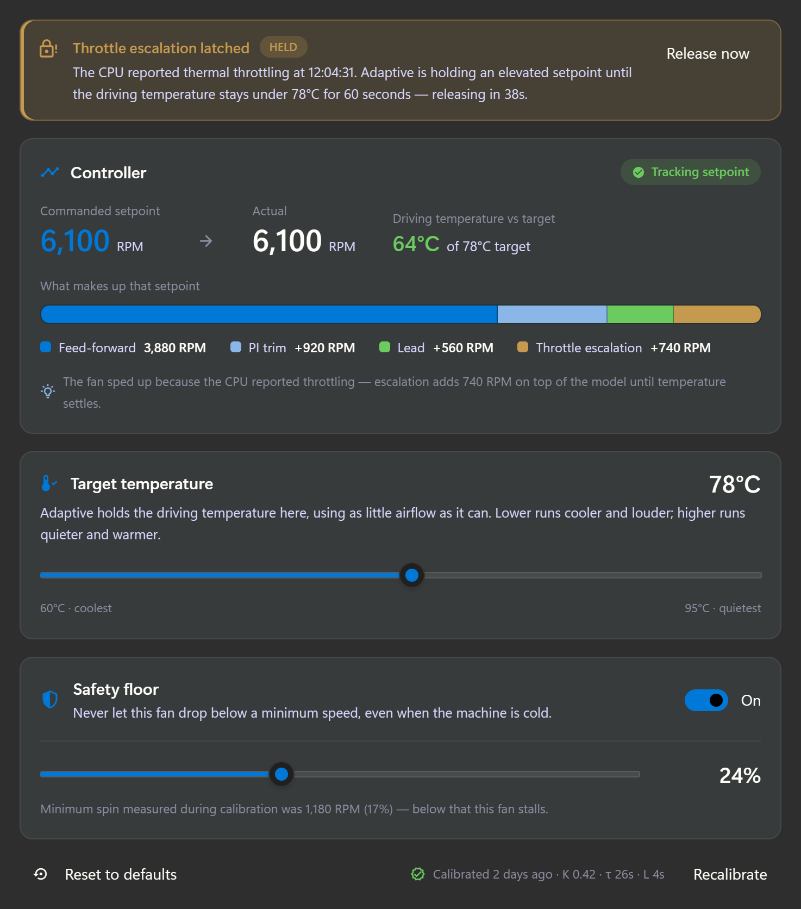
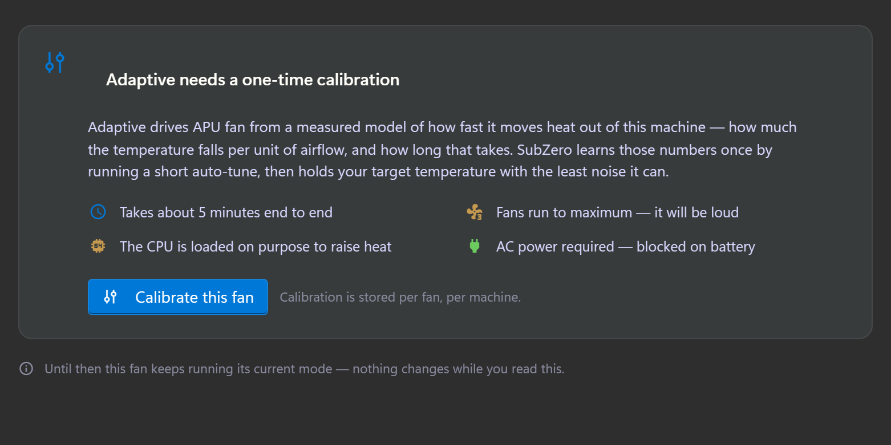
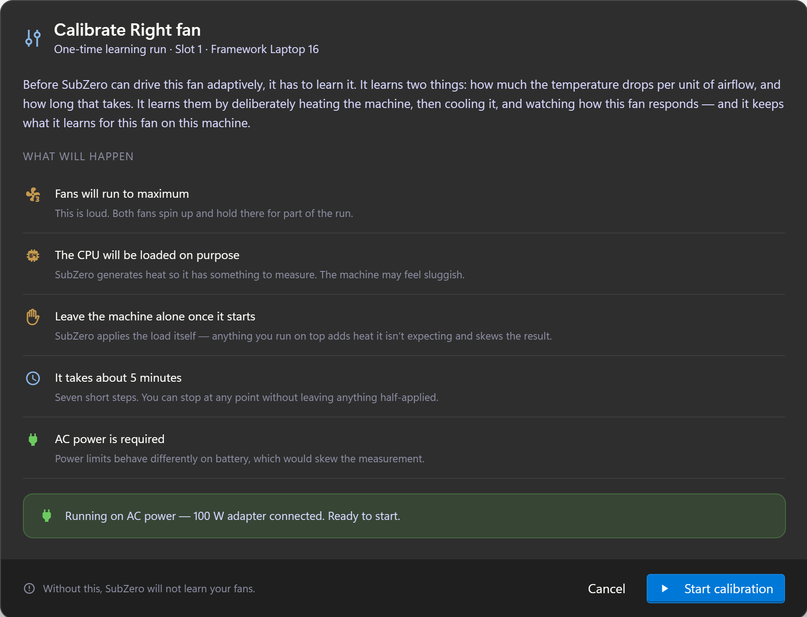
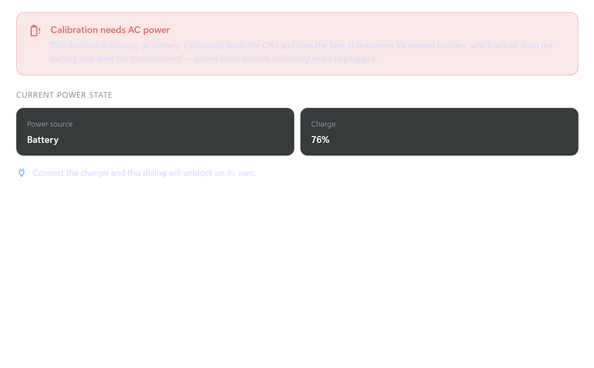
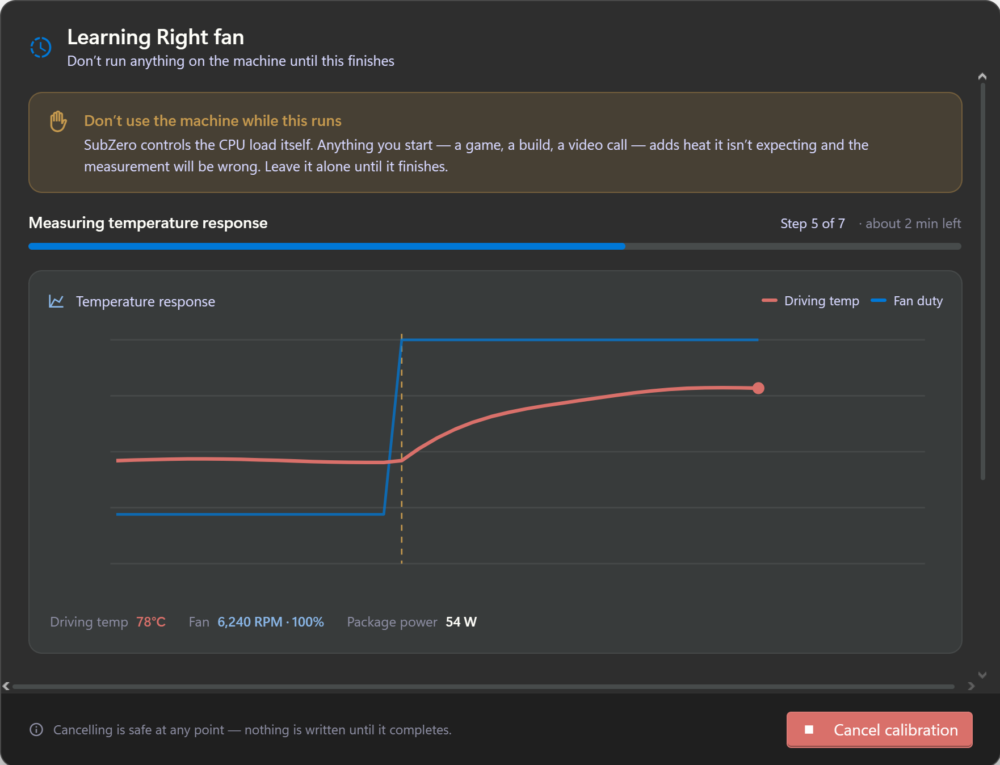
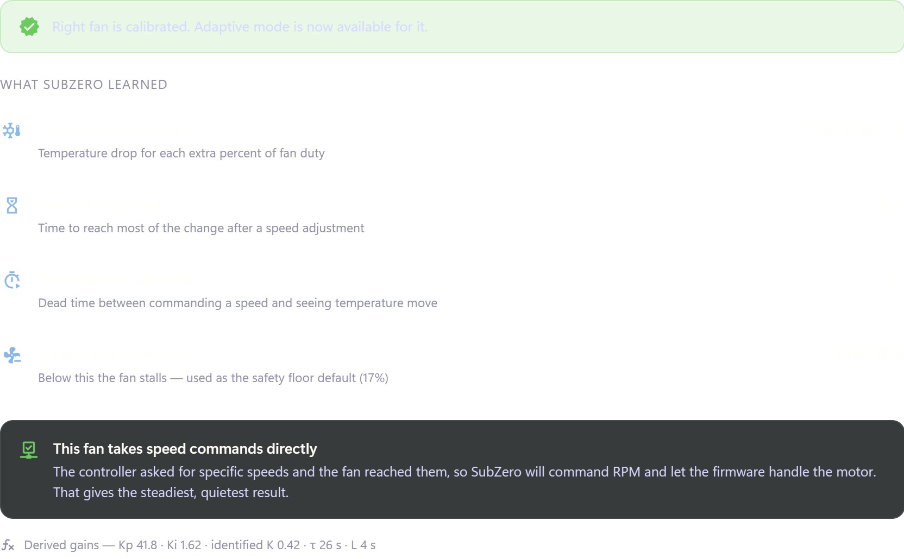
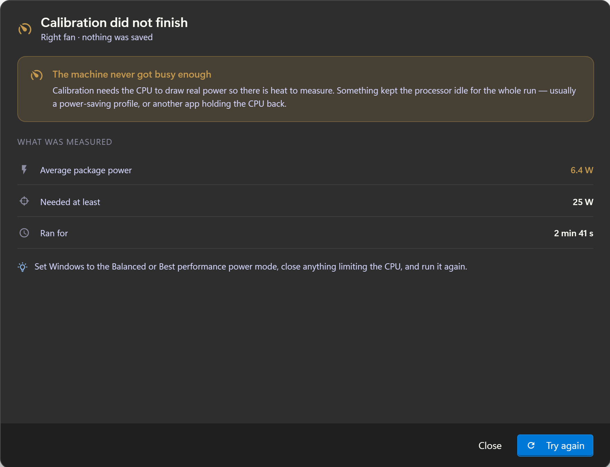
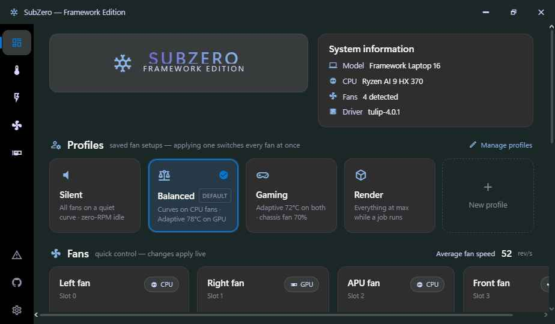
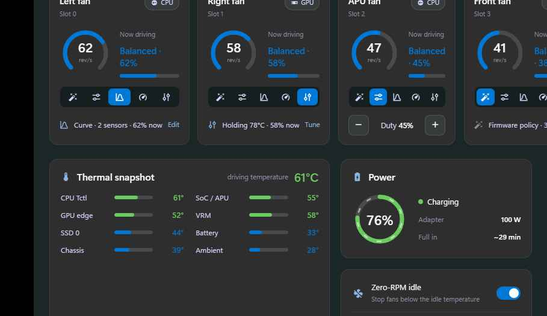

# SubZero — Adaptive fan control · design handoff

Bundle for implementing **Adaptive mode**, the **fan-learning (calibration) wizard**, and the
**profile model** on the Dashboard, in native **WinUI 3 / Uno Platform XAML**.

Companion to `design_handoff_subzero_fans/` — the brush table, shell rules and fan-editor
anatomy from that bundle still apply and are **not** repeated in full here.

---

## About the design files

The `.dc.html` files in this bundle are **design references created in HTML** — high-fidelity,
interactive prototypes of the intended look and behaviour. They are **not production code**.
Recreate them in XAML with the app's existing controls and brush resources; do not port markup.

| File | What it shows |
|------|----------------|
| `Fan Control.dc.html` | Fan editor with the new **Adaptive** mode (uncalibrated + calibrated) |
| `Fan Calibration.dc.html` | The **calibration wizard** dialog, all states |
| `Dashboard.dc.html` | Reworked **Profiles** model + mode-dependent per-fan controls |
| `Settings.dc.html` | Current Settings (unchanged; included for context) |

`Fan Calibration.dc.html` carries a **"Design review — state"** segmented control at the top of
the page. That strip is **scaffolding for reviewing states, not part of the shipping UI** — do
not build it. Everything below it is the real dialog.

## Fidelity

**High-fidelity.** Colours, type, spacing, layout and interaction are all intended as shown.

---

## Brand brushes (use the app's existing resources)

Reused verbatim from `design_handoff_subzero_fans`:

| Role | Brush / value |
|------|------|
| Accent / primary / selected | `BrandPrimaryBrush` `#0078D7` |
| Secondary text (lavender) | `BrandSecondaryBrush` / `TextSecondaryBrush` `#D7D8FF` |
| App background | `AppBackgroundBrush` `#1b2727` |
| Sidebar / icon rail | `SidebarBackgroundBrush` `#000000` |
| Card | `CardBackgroundBrush` `#2e2e2e` |
| Recessed / secondary card | `CardSecondaryBackgroundBrush` `#1f1f1f` |
| Card border | `CardBorderBrush` `#2b2e2d` (or hairline white ~7% alpha) |
| Elevated tile / unselected chip | ~`#383b3b`; gauge track ~`#474b4b` |
| Text primary | `TextPrimaryBrush` `#fffffa` |
| Text tertiary | ~`#8d8ea3` |
| Success | `StatusSuccessBrush` `#6ccb5f` (fg `#000`) |
| Warning | `StatusWarningBrush` `#c5994e` (fg `#000`) |
| Error / danger | `StatusErrorBrush` `#442726` bg, text `#d9706a` |
| Info / soft blue | `StatusInfoBrush` `#8AB7E8` (icons, gauge ghost) |

Translucent status washes used for banners: success `rgba(108,203,95,0.14)`,
warning `rgba(197,153,78,0.16)`, danger `rgba(217,112,106,0.16)`.

### Standing constraints (carry into every screen)
- **Do not restyle the title bar or the icon rail.** Page content only.
- **Pills** take a fixed `Height` and `CornerRadius = Height / 2`. `CornerRadius=999` with no
  height renders as an ellipse.
- Side panels run **full height** like the rail; scroll the **detail pane**, never the whole page.
- **Inventory existing controls** before drawing anything new.
- Adaptive must fit the existing **Stage → Preview → Apply** model and the unsaved-changes
  navigation guard.
- **Every quantity goes through `IUnitFormattingService`** in both directions — slider `Minimum`,
  `Maximum` and `Value` included.

---

## Iconography

All glyphs are **Material Design Icons (MDI)** — the SubZero/hardware set — rendered from the
`@mdi/font` webfont in the prototype. In XAML use the app's existing MDI `FontIcon` wrapper.

| Purpose | MDI name |
|---------|----------|
| Adaptive mode | `tune-vertical-variant` |
| Auto mode | `auto-fix` |
| Manual mode | `tune-variant` |
| Custom curve mode | `chart-bell-curve` |
| Max mode | `speedometer` |
| Calibrated badge | `check-decagram` |
| Calibration stale | `clock-alert-outline` |
| Not calibrated | `lock-outline` |
| Throttle latch | `lock-alert-outline` |
| Controller section | `chart-timeline-variant` |
| Tracking OK / off-setpoint | `check-circle` / `alert-circle-outline` |
| Target temperature | `thermometer-check` |
| Safety floor | `shield-half-full` |
| Reset to defaults | `backup-restore` |
| Explanation hint | `lightbulb-on-outline` |
| Don't-touch warning | `hand-back-left-outline` |
| Fans to maximum | `fan-speed-3` |
| CPU load | `cpu-64-bit` |
| AC power required / battery blocked | `power-plug` / `battery-alert-variant-outline` |
| Wizard step done / active / pending | `check-circle` / `progress-clock` / `circle-outline` |
| Failure: low load | `speedometer-slow` |
| Failure: low ΔT | `thermometer-minus` |
| Failure: ceiling | `thermometer-alert` |
| Failure: cancelled | `close-circle-outline` |
| Failure: disconnected | `lan-disconnect` |
| Profiles header | `account-cog-outline` |
| Save profile / edit profiles | `content-save-outline` / `pencil-outline` |

---

# Screen 1 — Adaptive mode in the fan editor

Modifies the **detail pane** of the existing Fan Control page. Everything else on that page
(fan list, header gauge, Applies-to card, action bar, stalled lockdown) is unchanged.



## Mode selector

The mode `SegmentedControl` gains a **fifth** segment. Order and labels:

`Auto · Manual · Curve · Max · Adaptive`

> The curve segment label is shortened to **"Curve"** so five segments fit the detail pane at
> the app's minimum width. Elsewhere (fan-list mode pill, headers) the mode is still spelled
> **"Custom curve"**.

Immediately to the right of the selector sits a **calibration pill** — visible **only while the
Adaptive segment is selected**:

| Calibration state | Pill | Background / foreground |
|---|---|---|
| `Ok` | `check-decagram` "Calibrated · {relative age}" | success wash / `#6ccb5f` |
| `Stale` | `clock-alert-outline` "Calibration stale" | warning wash / `#c5994e` |
| `None` | `lock-outline` "Not calibrated" | `#383b3b` / secondary text |

Pill geometry: `Height=24`, `CornerRadius=12`, padding `0,11`, `FontSize=11.5`, `SemiBold`.

The mode row is `flex-wrap` in HTML → in XAML use a **`WrapPanel`**-style container so the pill
drops to a second line rather than clipping the selector at narrow widths.

## State A — uncalibrated (the state most users meet first)



The Adaptive segment is **visible and selectable but cannot be armed**. Selecting it shows an
explanation, not an editor — and the **action bar swaps its Preview/Apply affordances for the
calibration call to action**, so the mode can never be staged for an uncalibrated fan.

Body: a card (`CardBackgroundBrush` elevated `#383b3b`, radius 12, padding 20) containing

- heading — **"Adaptive needs a one-time calibration"**
- body copy (static): *"Adaptive drives {FanLocation} from a measured model of how fast it moves
  heat out of this machine — how much the temperature falls per unit of airflow, and how long
  that takes. SubZero learns those numbers once by running a short auto-tune, then holds your
  target temperature with the least noise it can."*
- a 2-column fact grid — icon + one line each:
  - `clock-outline` — "Takes about 5 minutes end to end"
  - `fan-speed-3` — "Fans run to maximum — it will be loud"
  - `cpu-64-bit` — "The CPU is loaded on purpose to raise heat"
  - `power-plug` — "AC power required — blocked on battery"
- primary **`Calibrate this fan`** button + caption "Calibration is stored per fan, per machine."
- footnote: "Until then this fan keeps running its current mode — nothing changes while you read this."

**Action bar (uncalibrated):** `lock-outline` + *"Adaptive can't be applied to {FanLocation}
until it has been calibrated."* + a **Calibrate this fan** button. The normal
Discard / Preview / "no unsaved changes" rows are suppressed.

## State B — calibrated editor

Three stacked sections inside the scrolling detail body.

### 1. Controller readout — the part worth getting right

Without it an adaptive fan is unexplainable; with it the user can see *why it just sped up*.

| Element | Value | Bound to |
|---|---|---|
| Section title | "Controller" | static |
| Tracking chip | "Tracking setpoint" **or** "Off setpoint by {n} RPM" | derived: `|Setpoint − Actual| ≤ 350 RPM` |
| Commanded setpoint | `6,100` RPM, accent | `Controller.SetpointRpm` |
| Actual | `6,100` RPM | `Fan.CurrentRpm` |
| Driving temperature vs target | `64°C of 78°C target` | `Fan.DrivingTemperature` / `Adaptive.TargetTemperature` |
| Contribution bar | 4 stacked segments | see below |
| Explanation line | one sentence | derived, see below |

**Stacked contribution bar** — height 16, radius 8, recessed track, 1px dark divider between
segments. Each segment's width is its share of the setpoint:

| Term | Colour | Meaning shown to the user |
|---|---|---|
| Feed-forward | `#0078D7` accent | from CPU package power |
| PI trim | `#8AB7E8` violet | closing the gap to target |
| Lead | `#6ccb5f` success | temperature is still rising |
| Throttle escalation | `#c5994e` warning | latched after a throttle event |

Legend below the bar: colour swatch (10×10, radius 3) + term + signed value
(`3,880 RPM`, `+920 RPM`, `+560 RPM`, `+740 RPM`). **Terms with a zero contribution are omitted
entirely** — do not render empty legend entries.

Explanation line (`lightbulb-on-outline`, tertiary text):
- when latched → *"The fan sped up because the CPU reported throttling — escalation adds {n} RPM
  on top of the model until temperature settles."*
- otherwise → *"Feed-forward reacts to CPU power before the temperature moves; PI trim corrects
  whatever it misses."*

### 2. Throttle escalation — latched indicator

Rendered **above** the Controller card when latched, and visually distinct from a transient chip:
warning wash, warning border, **3px left accent bar** (`inset 3px 0 0 0` in HTML → a `Border`
with a coloured left edge), `lock-alert-outline`, the title **"Throttle escalation latched"**,
and a small **`HELD`** badge (`Height=20`, `CornerRadius=10`, warning-on-warning).

Message: *"The CPU reported thermal throttling at {hh:mm:ss}. Adaptive is holding an elevated
setpoint until the driving temperature stays under {target} for 60 seconds — releasing in {n}s."*

A subtle **`Release now`** button clears the latch manually.

### 3. Target temperature

Card with `thermometer-check`, title, the current value large on the right, one line of
explanation (*"Adaptive holds the driving temperature here, using as little airflow as it can.
Lower runs cooler and louder; higher runs quieter and warmer."*), then a `Slider`.

- `Minimum` 60, `Maximum` 95, `SmallChange` 1 — **all three, plus `Value`, through
  `IUnitFormattingService`** (a °F user sees 140–203 °F).
- End labels: "{min} · coolest" and "{max} · quietest".

### 4. Safety floor

Card with `shield-half-full`, title **"Safety floor"**, subtitle *"Never let this fan drop below
a minimum speed, even when the machine is cold."*, and a `ToggleSwitch` on the right.

When **on**, a divider then a `Slider` (0–60 %) + large value, and the caption *"Minimum spin
measured during calibration was {value} — below that this fan stalls."* (bound to the calibration
result, not a constant).

### 5. Footer row

`Reset to defaults` (subtle, `backup-restore`) · spacer · `check-decagram-outline` + *"Calibrated
{age} · K 0.42 · τ 26s · L 4s"* · `Recalibrate` (subtle).

## Staging behaviour

Target temperature, safety-floor toggle, floor value and the mode switch itself **all stage** —
they flow through the existing dirty/Preview/Apply model and the navigation guard. The
**Release now** latch action is an immediate command, **not** a staged change.

---

# Screen 2 — Calibration wizard

A modal dialog over the dimmed app (`ContentDialog`). **880 × min 680**, radius 14,
`CardBackgroundBrush`, 1px `#ffffff21` border, shadow `0 32 64 rgba(0,0,0,0.55)`.
Structure: fixed header · scrolling body · fixed footer separated by a 1px divider on
`CardSecondaryBackgroundBrush`.

Header = icon + title + subtitle; both change per state:

| State | Icon / colour | Title | Subtitle |
|---|---|---|---|
| Consent | `tune-vertical-variant` accent | Calibrate {FanLocation} | One-time learning run · {Slot} · {Model} |
| Blocked | `battery-alert-variant-outline` danger | Calibrate {FanLocation} | Cannot start while on battery power |
| Running | `progress-clock` accent | **Learning** {FanLocation} | Don't run anything on the machine until this finishes |
| Result | `check-decagram` success | SubZero has learned this fan | {FanLocation} · measured just now |
| Failure | per-failure icon | Calibration did not finish | {FanLocation} · nothing was saved |

> **Language:** the user-facing verb is **learn**, not "auto-tune" or "identify". "Calibrate"
> survives only as the action name on buttons and the badge.

## Consent



Intro (static): *"Before SubZero can drive this fan adaptively, it has to learn it. It learns two
things: how much the temperature drops per unit of airflow, and how long that takes. It learns
them by deliberately heating the machine, then cooling it, and watching how this fan responds —
and it keeps what it learns for this fan on this machine."*

Then **"WHAT WILL HAPPEN"** — five divider-separated rows, icon + label + sub:

1. `fan-speed-3` **Fans will run to maximum** — "This is loud. Both fans spin up and hold there for part of the run."
2. `cpu-64-bit` **The CPU will be loaded on purpose** — "SubZero generates heat so it has something to measure. The machine may feel sluggish."
3. `hand-back-left-outline` **Leave the machine alone once it starts** — "SubZero applies the load itself — anything you run on top adds heat it isn't expecting and skews the result."
4. `clock-outline` **It takes about 5 minutes** — "Seven short steps. You can stop at any point without leaving anything half-applied."
5. `power-plug` **AC power is required** — "Power limits behave differently on battery, which would skew the measurement."

Bottom: a success banner — *"Running on AC power — {adapter} adapter connected. Ready to start."*

Footer: `alert-circle-outline` "Without this, SubZero will not learn your fans." · **Cancel** · **Start calibration** (accent, `play`).

## Blocked — on battery



Explicit, not a disabled button with no reason. Danger banner **"Calibration needs AC power"** +
*"This machine is running on battery. Calibration loads the CPU and runs the fans at maximum for
several minutes, which would drain the battery and skew the measurement — power limits behave
differently when unplugged."*

Then **"CURRENT POWER STATE"** — two tiles: Power source `Battery`, Charge `{n}%`.
Closing line: *"Connect the charger and this dialog will unblock on its own."*

**No primary button.** Footer note "Waiting for AC power." + **Close**. The dialog must
**re-evaluate live** and unblock when AC is attached.

## Running



Top: the amber **"Don't use the machine while this runs"** banner (`hand-back-left-outline`) —
*"SubZero controls the CPU load itself. Anything you start — a game, a build, a video call — adds
heat it isn't expecting and the measurement will be wrong. Leave it alone until it finishes."*

Then current step name · `Step {n} of 7` · `{remaining} left`, and a 6px accent progress bar.

**Temperature response plot** (from the server-streamed updates): temperature (danger red, 2.4px)
and fan duty (accent, 1.8px, 75% opacity) against time, with the **step change marked** by a
dashed warning vertical line labelled "Fan → 100%", and a dot on the live head of the temp trace.
Live readouts under it: Driving temp · Fan (RPM + %) · Package power.

> **LiveCharts note:** small charts need `TextSize="0"` and `Padding="0,0"` on the axes or they
> render nothing.

**The seven steps**, listed with `check-circle` (done) / `progress-clock` (active, pulsing) /
`circle-outline` (pending):

| # | Label | Note |
|---|---|---|
| 1 | Settling at idle | baseline temperature |
| 2 | Finding minimum spin | lowest duty that keeps turning |
| 3 | Stepping fan to maximum | step change applied |
| 4 | Loading the CPU | raising heat on purpose |
| 5 | Measuring temperature response | watching the curve settle |
| 6 | Fitting the thermal model | identifying K, τ and L |
| 7 | Verifying speed tracking | cascade or duty fallback |

Footer: note *"Cancelling is safe at any point — nothing is written until it completes."* +
**Cancel calibration** (danger). **Cancel is prominent and available at every moment** — there is
no secondary button competing with it.

## Result



Success banner: *"{FanLocation} is calibrated. Adaptive mode is now available for it."*

**"WHAT SUBZERO LEARNED"** — plain language first, value on the right, jargon in the sub-line:

| Label | Value | Sub |
|---|---|---|
| How much this fan cools | `0.42 °C per 1%` | Temperature drop for each extra percent of fan duty |
| How fast it responds | `26 s` | Time to reach most of the change after a speed adjustment |
| Delay before it takes effect | `4 s` | Dead time between commanding a speed and seeing temperature move |
| Slowest it can safely turn | `1,180 RPM` | Below this the fan stalls — used as the safety floor default (17%) |

**EC-tracking verdict** — its own card, in plain language:
- cascade → `check-network-outline` success, **"This fan takes speed commands directly"** —
  *"The controller asked for specific speeds and the fan reached them, so SubZero will command RPM
  and let the firmware handle the motor. That gives the steadiest, quietest result."*
- duty fallback → same shape, warning tone, explaining SubZero will command duty instead.

Control-theory numbers are demoted to a single tertiary footnote:
*"Derived gains — Kp 41.8 · Ki 1.62 · identified K 0.42 · τ 26 s · L 4 s"*.

Footer: **Close** · **Use Adaptive mode** (accent) — which closes the dialog and leaves the fan
editor on Adaptive, staged.

## Failures — distinct copy per cause



All five share one layout: severity banner (icon + title + body) → **measured-values table** →
`lightbulb-on-outline` advice line → footer **Close** + a retry primary. Never a generic error.

| Cause | Tone | Title | Table rows | Advice / primary |
|---|---|---|---|---|
| Insufficient load | warning | The machine never got busy enough | Average package power `6.4 W`; Needed at least `25 W`; Ran for `2 min 41 s` | Set Windows to Balanced/Best performance, close anything limiting the CPU · **Try again** |
| Insufficient ΔT | warning | The temperature barely moved | Temperature swing `2.1 °C`; Needed at least `8 °C`; Ambient `19 °C` | Cool room or well-ventilated dock causes this; retry at normal room temperature · **Try again** |
| Temperature ceiling | danger | Stopped early to protect the machine | Peak temperature `97 °C`; Safety ceiling `95 °C`; Stopped at step `4 of 7` | Usually blocked vents or dust; check airflow · **Try again** |
| Cancelled | neutral | Calibration cancelled | Stopped at step `3 of 7`; Saved `Nothing`; Fans restored `Yes` | Start again whenever the machine is free · **Start again** |
| Client disconnected | danger | Lost contact with the SubZero service | Stopped at step `5 of 7`; Fans restored by service `Yes`; Service now `Reachable` | Retry; if it repeats, restart the service from Settings · **Try again** |

Every failure states explicitly that **nothing was saved** and that the **fans were restored** —
the temperature-ceiling and disconnect cases say *who* restored them (service-side watchdog).

---

# Screen 3 — Dashboard: profiles are user profiles



## What changed and why

The old tiles (Silent / Balanced / Performance / Turbo / Custom) were **duty shortcuts** — each
just slammed every fan to a fixed percentage. They are now **saved user configurations**.

A profile stores a **per-fan map of mode + settings**, e.g.

```
Balanced (default)
  Left fan   → Custom curve
  Right fan  → Adaptive, target 78 °C
  APU fan    → Manual 45%
  Front fan  → Auto
```

Applying a profile switches every fan's mode at once. Shipped examples: **Silent**,
**Balanced** (ᴅᴇꜰᴀᴜʟᴛ), **Gaming**, **Render** — each tile shows name, a ᴅᴇꜰᴀᴜʟᴛ marker where
applicable, and a subtitle describing the **actual configuration** ("Curves on CPU fans ·
Adaptive 78 °C on GPU"), not a mood.

- A final **dashed "New profile" tile** (`plus`) creates one from the current state.
- Header carries **Manage profiles** (`pencil-outline`) and, when the live configuration no
  longer matches the applied profile, a **Modified** chip (warning) + **Save as profile**.
- Editing any fan sets `profile = custom` → the Modified chip appears; **no tile is highlighted**.

**Where profiles are authored:** recommend the **Fan Control** page rather than a separate page —
a profile is a snapshot of exactly what that page already edits. A dedicated page only earns its
place if profiles gain triggers (auto-switch on AC/battery, on launch, on app detection). Not
built either way — decide before implementing.

## Per-fan controls — the mode conflict



Previously each card showed Auto/Manual/Max **and** a ± duty stepper at all times, so the stepper
contradicted the selected mode, and Custom curve was missing entirely.

Now each card has **all five modes** as a compact icon segmented control
(`auto-fix`, `tune-variant`, `chart-bell-curve`, `speedometer`, `tune-vertical-variant`), and the
**control row underneath changes with the mode**:

| Mode | Control row |
|---|---|
| Manual | − / **Duty {n}%** / + stepper (the **only** place duty is editable) |
| Custom curve | `chart-bell-curve` "Curve · {n} sensors · {duty}% now" + **Edit** link |
| Adaptive | `tune-vertical-variant` "Holding {target} · {duty}% now" + **Tune** link |
| Max | `speedometer` "Full speed · 100% commanded" (warning icon) |
| Auto | `auto-fix` "Firmware policy · {duty}% now" (tertiary) |

The per-card **Boost** button was removed — it was a second way to say Max.

The card keeps its gauge (`{rev/s}` centre), the location + slot + function pill, and a "Now
driving" line showing the effective mode and duty.

---

## Static vs bound

**Static text** (ships in XAML, never changes at runtime): all section titles and headings, the
five consent rows, the seven step labels and their notes, the failure titles/bodies/advice, the
Controller term names (Feed-forward, PI trim, Lead, Throttle escalation), the target-temperature
and safety-floor explanations, the "what SubZero learned" labels and sub-lines, and the
tracking/latch copy templates.

**Bound** (everything numeric, stateful or per-fan):

| Binding | Used by |
|---|---|
| `Fan.Location`, `Fan.Slot`, `Fan.Function` | headers, fan list, all dialog titles |
| `Fan.CurrentRpm`, `Fan.DutyPercent` | gauges, Actual, "{n}% now" |
| `Fan.DrivingTemperature` | Controller temp vs target |
| `Fan.CalibrationState` (`None`/`Ok`/`Stale`) + `CalibratedAt` | mode pill, uncalibrated lockout, list badges |
| `Adaptive.TargetTemperature`, `.SafetyFloorEnabled`, `.SafetyFloorPercent` | editor controls (staged) |
| `Adaptive.MinSpinRpm` | floor caption |
| `Controller.SetpointRpm` + `.FeedForward/.PiTrim/.Lead/.ThrottleEscalation` | contribution bar + legend |
| `Controller.ThrottleLatched`, `.LatchedAt`, `.LatchReleaseSeconds` | latched banner |
| `Calibration.Step`, `.StepCount`, `.RemainingEstimate`, `.TemperatureSeries`, `.DutySeries`, `.PackagePowerWatts` | wizard progress + plot |
| `Calibration.Result.{K, Tau, L, MinSpinRpm, Kp, Ki, TrackingMode}` | result screen |
| `Calibration.Failure.{Reason, MeasuredValues}` | failure screens |
| `Power.IsOnAc`, `Power.AdapterWatts`, `Power.ChargePercent` | consent banner, blocked state |
| `Profiles[]`, `ActiveProfile`, `IsModified` | Dashboard profile tiles |

All temperatures, speeds, powers, voltages and currents render through
**`IUnitFormattingService`** — including slider bounds.

---

## Not built yet (from the workstream brief)

Screens 3–6 of the original brief are additive to surfaces that already exist and were
deliberately deferred until the Adaptive vocabulary settled. They still need designs:

1. **Calibration status in the fan list** — per-fan calibrated / not-calibrated / stale badge
   reusing the existing status-pill geometry, plus a recalibrate entry point. *(The data model is
   already in the prototype: `Left` ok, `Right` ok, `APU` none, `Front` stale.)*
2. **Settings: polling tiers** — three clamped interval controls, each explained by what it
   governs, with an honest note that a faster primary tier costs CPU.
3. **Telemetry surfaces** — GPU power / temperature / clock / throttle reasons, and a
   partial-data state for Windows AMD/Intel (utilisation only) that reads as a stated platform
   limitation with a reason, not a blank cell.
4. **Warnings** — an entry for Adaptive running without feed-forward power data, explaining the
   degraded mode.
