# SubZero — Adaptive fan control · design handoff

Bundle for implementing **Adaptive mode**, the **fan-learning (calibration) wizard**, and the
**profile model** on the Dashboard, in native **WinUI 3 / Uno Platform XAML**.

Companion to `design_handoff_subzero_fans/` — the brush table, shell rules and fan-editor
anatomy from that bundle still apply and are **not** repeated in full here.

---

## About the design files

The `.dc.html` files in this bundle are **design references created in HTML** — high-fidelity,
interactive prototypes of the intended look and behaviour. They are **not production code**.
Recreate them in XAML with the app's existing controls and brush resources; do not port markup.

| File | What it shows |
|------|----------------|
| `Fan Control.dc.html` | Fan editor with the new **Adaptive** mode (uncalibrated + calibrated) |
| `Fan Calibration.dc.html` | The **calibration wizard** dialog, all states |
| `Adaptive Confidence States.dc.html` | Reference sheet — all 4 confidence treatments × 3 learning states |
| `Adaptive Control Explained.dc.html` | The **control-design explainer** page (screen 6) |
| `Dashboard.dc.html` | Reworked **Profiles** model + mode-dependent per-fan controls |
| `Settings.dc.html` | Current Settings (unchanged; included for context) |

`Fan Calibration.dc.html` carries a **"Design review — state"** segmented control at the top of
the page. That strip is **scaffolding for reviewing states, not part of the shipping UI** — do
not build it. Everything below it is the real dialog.

## Fidelity

**High-fidelity.** Colours, type, spacing, layout and interaction are all intended as shown.

---

## Brand brushes (use the app's existing resources)

Reused verbatim from `design_handoff_subzero_fans`:

| Role | Brush / value |
|------|------|
| Accent / primary / selected | `BrandPrimaryBrush` `#0078D7` |
| Secondary text (lavender) | `BrandSecondaryBrush` / `TextSecondaryBrush` `#D7D8FF` |
| App background | `AppBackgroundBrush` `#1b2727` |
| Sidebar / icon rail | `SidebarBackgroundBrush` `#000000` |
| Card | `CardBackgroundBrush` `#2e2e2e` |
| Recessed / secondary card | `CardSecondaryBackgroundBrush` `#1f1f1f` |
| Card border | `CardBorderBrush` `#2b2e2d` (or hairline white ~7% alpha) |
| Elevated tile / unselected chip | ~`#383b3b`; gauge track ~`#474b4b` |
| Text primary | `TextPrimaryBrush` `#fffffa` |
| Text tertiary | ~`#8d8ea3` |
| Success | `StatusSuccessBrush` `#6ccb5f` (fg `#000`) |
| Warning | `StatusWarningBrush` `#c5994e` (fg `#000`) |
| Error / danger | `StatusErrorBrush` `#442726` bg, text `#d9706a` |
| Info / soft blue | `StatusInfoBrush` `#8AB7E8` (icons, gauge ghost) |

Translucent status washes used for banners: success `rgba(108,203,95,0.14)`,
warning `rgba(197,153,78,0.16)`, danger `rgba(217,112,106,0.16)`.

### Standing constraints (carry into every screen)
- **Do not restyle the title bar or the icon rail.** Page content only.
- **Pills** take a fixed `Height` and `CornerRadius = Height / 2`. `CornerRadius=999` with no
  height renders as an ellipse.
- Side panels run **full height** like the rail; scroll the **detail pane**, never the whole page.
- **Inventory existing controls** before drawing anything new.
- Adaptive must fit the existing **Stage → Preview → Apply** model and the unsaved-changes
  navigation guard.
- **Every quantity goes through `IUnitFormattingService`** in both directions — slider `Minimum`,
  `Maximum` and `Value` included.

---

## Iconography

All glyphs are **Material Design Icons (MDI)** — the SubZero/hardware set — rendered from the
`@mdi/font` webfont in the prototype. In XAML use the app's existing MDI `FontIcon` wrapper.

| Purpose | MDI name |
|---------|----------|
| Adaptive mode | `tune-vertical-variant` |
| Auto mode | `auto-fix` |
| Manual mode | `tune-variant` |
| Custom curve mode | `chart-bell-curve` |
| Max mode | `speedometer` |
| Calibrated badge | `check-decagram` |
| Calibration stale | `clock-alert-outline` |
| Not calibrated | `lock-outline` |
| Throttle latch | `lock-alert-outline` |
| Controller section | `chart-timeline-variant` |
| Tracking OK / off-setpoint | `check-circle` / `alert-circle-outline` |
| Target temperature | `thermometer-check` |
| Safety floor | `shield-half-full` |
| Reset to defaults | `backup-restore` |
| Calibration & reference card | `wrench-outline` |
| Explainer / how it works | `book-open-variant` |
| Explainer: cascade chain blocks | `thermometer`, `chart-timeline-variant`, `target`, `chip`, `fan` |
| Explainer: verdict cards | `check-network-outline` / `alert-decagram-outline` |
| Explainer: control-law terms | `flash`, `tune-variant`, `trending-up`, `lock-alert-outline`, `shield-half-full`, `speedometer-slow` |
| Explainer: feedback strip | `arrow-u-left-bottom` |
| Explanation hint | `lightbulb-on-outline` |
| Don't-touch warning | `hand-back-left-outline` |
| Fans to maximum | `fan-speed-3` |
| CPU load | `cpu-64-bit` |
| AC power required / battery blocked | `power-plug` / `battery-alert-variant-outline` |
| Wizard step done / active / pending | `check-circle` / `progress-clock` / `circle-outline` |
| Failure: low load | `speedometer-slow` |
| Failure: low ΔT | `thermometer-minus` |
| Failure: ceiling | `thermometer-alert` |
| Failure: cancelled | `close-circle-outline` |
| Failure: disconnected | `lan-disconnect` |
| Profiles header | `account-cog-outline` |
| Save profile / edit profiles | `content-save-outline` / `pencil-outline` |

---

# Screen 1 — Adaptive mode in the fan editor

Modifies the **detail pane** of the existing Fan Control page. Everything else on that page
(fan list, header gauge, Applies-to card, action bar, stalled lockdown) is unchanged.


## Mode selector

The mode `SegmentedControl` gains a **fifth** segment. Order and labels:

`Auto · Manual · Curve · Adaptive · Max`

> Adaptive sits **after Curve**, with the other model-driven modes; Max stays the terminal option.
> The curve segment label is shortened to **"Curve"** so five segments fit the detail pane at
> the app's minimum width. Elsewhere (fan-list mode pill, headers) the mode is still spelled
> **"Custom curve"**.
>
> **Clipping caution:** five segments overflow a narrow detail pane. Let the selector shrink and
> scroll horizontally (`min-width:0` on the row, an overflow-x container around the control) —
> a fixed-width segmented control gets cut off, which we hit and fixed.

Immediately to the right of the selector sits a **learning-state pill** — visible **only while the
Adaptive segment is selected**. It reports what the controller knows, never a readiness gate:

| Learning state | Pill | Background / foreground |
|---|---|---|
| `Learning` | `school-outline` "Getting to know this fan" | `#383b3b` / secondary text |
| `Converging` | `chart-bell-curve-cumulative` "Learned from {n} quiet periods" | violet 18% / `#8AB7E8` |
| `Confident` | `check-decagram` "Knows this fan well" | success wash / `#6ccb5f` |

Pill geometry: `Height=24`, `CornerRadius=12`, padding `0,11`, `FontSize=11.5`, `SemiBold`.

The mode row is `flex-wrap` in HTML → in XAML use a **`WrapPanel`**-style container so the pill
drops to a second line rather than clipping the selector at narrow widths.

---

# ⚠ The inversion — read this before Screen 1

An earlier revision of this bundle treated the hot-test calibration as a **gate**: an uncalibrated
fan could not use Adaptive, and the editor showed a lockout with a *"Calibrate this fan"* call to
action. **That is no longer the design.**

The controller now identifies the machine's thermal model from ordinary use — recursive least
squares over settled operating points, fitting `T ≈ a + b·P − K·duty`. Therefore:

- **Adaptive arms immediately, on any fan, with no calibration.** There is no lockout state, and
  no gated action bar. Delete both if you built them.
- It starts from deliberately conservative defaults and improves the longer the machine runs.
- The hot test still exists but is an **optional accelerator** — "learn this in 4 minutes instead
  of over the next few days" — never a prerequisite.

So the design problem is no longer a lockout. It is **representing confidence honestly over time
without making the user anxious about a fan that is working fine.**

| State | What is true | What the user should feel |
|---|---|---|
| **Learning** | Running on safe defaults; model not yet separable | "It works. It is getting to know my machine." |
| **Converging** | Model identified, still refining; confidence rising | Quiet progress. Not a warning. |
| **Confident** | Model stable, many observations | Nothing to do. Numbers are trustworthy. |

**Explicitly avoid:** progress bars that imply the fan is broken until full, percentage-complete
framing, badges that read like errors, and anything that makes "still learning" feel like a fault.
**A fan on defaults is a working fan, not a degraded one.**

---

## The confidence card — "What SubZero knows about this fan"

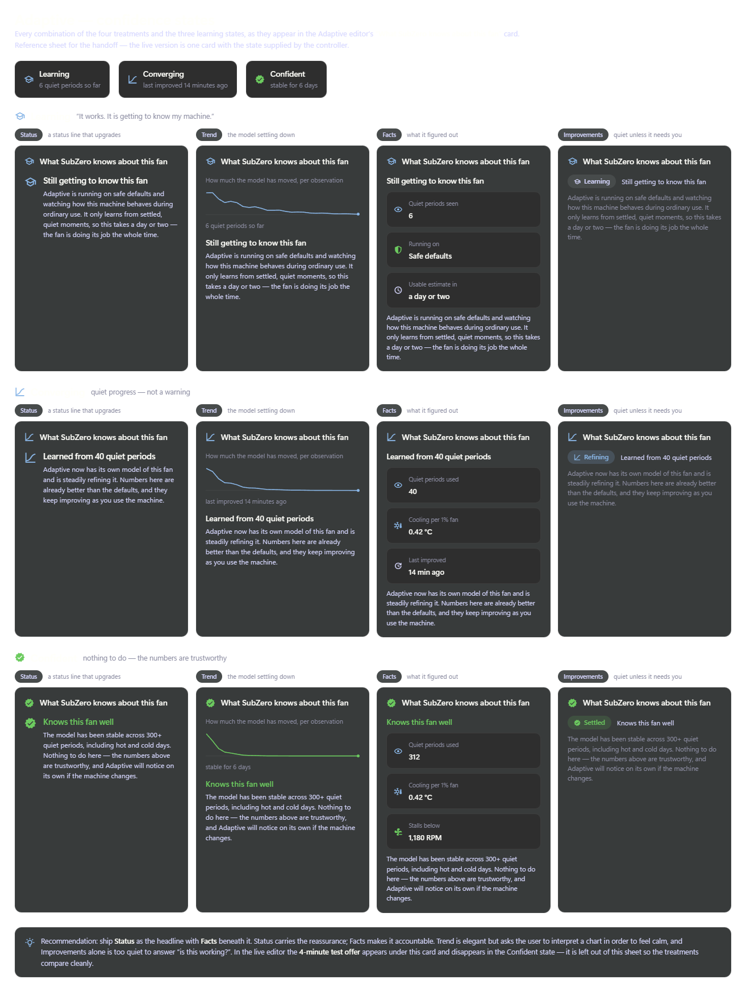

Sits directly under the controller readout. `Adaptive Confidence States.dc.html` is a reference
sheet rendering **all four treatments × all three states**; the live editor is one card whose state
comes from the controller. The editor carries a `DESIGN REVIEW · state / treatment` switcher row so
reviewers can see every combination — **that row is scaffolding, not shipping UI.**

Bound inputs: observation count, whether the model is identified, when it last improved, whether
the fan has ever had a hot test. **Show what the machine has figured out, not a completion metric.**

### Four treatments

| Treatment | Shape | Reads as |
|---|---|---|
| **Status** | icon + headline that upgrades + one supporting line | reassurance, instantly legible |
| **Trend** | sparkline of *how much the model moved* per observation, decaying to flat, + headline | convergence as calm; needs interpretation |
| **Facts** | tiles — quiet periods used, cooling per 1% fan, stalls below | accountable, concrete |
| **Improvements** | a small chip + one line, deliberately unemphatic | quiet; designed to grow prominent **only** when something is wrong (model contradicted, likely blocked vent) |

**Recommendation: ship Status as the headline with Facts beneath it.** Status carries the
reassurance; Facts makes it accountable. Trend is elegant but asks the user to interpret a chart in
order to feel calm. Improvements alone is too quiet to answer "is this working?".

Note the Learning-state Facts tile: it reads **"Running on: Safe defaults"** rather than leaving a
blank where a measured value will go — the absence of a model is stated as a working configuration.

### Copy per state (static templates, numbers bound)

| State | Headline | Body |
|---|---|---|
| Learning | "Still getting to know this fan" | Running on safe defaults, watching ordinary use; learns only from settled quiet moments, so a day or two — **"the fan is doing its job the whole time"** |
| Converging | "Learned from {n} quiet periods" | Has its own model and is refining it; already better than the defaults |
| Confident | "Knows this fan well" | Stable across 300+ quiet periods, hot and cold days; **"Nothing to do here"**, and it will notice on its own if the machine changes |

### The calibration offer, inline

Below a hairline divider in the same card: `clock-fast` + *"In a hurry? A 4-minute test would teach
it everything at once."* + a **Run the 4-minute test** button. It **disappears entirely in the
Confident state** — there is nothing left to accelerate.

## Response — the λ knob as felt consequences

Card, `metronome`. λ is internally the closed-loop time constant (2–16 s, default 8 s) and **must
never look like a control-theory parameter.**

- Slider runs **Quick → Calm**; the header shows the *named* value: Quick / Eager / Steady / Calm /
  Very calm. End labels are "Quick" and "Calm", not seconds.
- Two live consequence bars: **Back on target within ~{(λ + L) × 3.4} s** (turns warning above
  58 s) and **Fan speed changes** — `restless` ≤ 4 s → `busy` → `steady` → `very calm` ≥ 11 s.
- A small overshoot preview: the response curve at the current λ against a dashed ghost of the
  default, captioned "dashed = the default setting".
- Raw values live in a collapsed **Advanced** disclosure: λ in seconds, `Kᶜ`, `τᵢ`. Collapsed by
  default, chevron-right → chevron-down.

## Optional tools

Replaces the old "Calibration & reference" card. Header `wrench-outline` **"Optional tools"** with
the right-aligned line **"Nothing here is required — Adaptive works without it."** Four actions, the
first three identical outlined buttons (`Height=34`, `CornerRadius=8`, padding `0,14`, 12.5px text,
15px icon at 8px gap):

| Action | Icon | Notes |
|---|---|---|
| Reset to defaults | `backup-restore` | target 78 °C, floor on, floor 24%, λ 8 s — **staged** |
| 4-minute learning test | `clock-fast` | opens the wizard |
| How adaptive control works | `book-open-variant` | opens the explainer (Screen 6) |
| Forget what it learned | `delete-outline` | right-aligned, destructive red text, transparent fill |

---

## What was deleted from the previous revision

So an implementer does not build the old model by accident:

- The **uncalibrated lockout** card ("Adaptive needs a one-time calibration") — gone.
- The **gated action bar** row ("Adaptive can't be applied to {FanLocation} until it has been
  calibrated") — gone; Adaptive stages and previews like every other mode.
- The **calibration pill** as a readiness badge (`Calibrated` / `Stale` / `Not calibrated`) —
  replaced by the learning-state pill above.
- The safety-floor caption no longer says "measured during calibration": it reads **"Below about
  {n} RPM this fan stalls."**, which is true whether the value came from the test or from
  gradual learning.

## The editor's section order

Latched banner (when latched) → **Controller** → **What SubZero knows about this fan** → **Target
temperature** → **Response** → **Safety floor** → **Optional tools**.

## Adaptive editor — controller readout

Three stacked sections inside the scrolling detail body.

### 1. Controller readout — the part worth getting right

Without it an adaptive fan is unexplainable; with it the user can see *why it just sped up*.

| Element | Value | Bound to |
|---|---|---|
| Section title | "Controller" | static |
| Tracking chip | "Tracking setpoint" **or** "Off setpoint by {n} RPM" | derived: `|Setpoint − Actual| ≤ 350 RPM` |
| Commanded setpoint | `6,100` RPM, accent | `Controller.SetpointRpm` |
| Actual | `6,100` RPM | `Fan.CurrentRpm` |
| Driving temperature vs target | `64°C of 78°C target` | `Fan.DrivingTemperature` / `Adaptive.TargetTemperature` |
| Contribution bar | 4 stacked segments | see below |
| Explanation line | one sentence | derived, see below |

**Stacked contribution bar** — height 16, radius 8, recessed track, 1px dark divider between
segments. Each segment's width is its share of the setpoint:

| Term | Colour | Meaning shown to the user |
|---|---|---|
| Feed-forward | `#0078D7` accent | from CPU package power |
| PI trim | `#8AB7E8` violet | closing the gap to target |
| Lead | `#6ccb5f` success | temperature is still rising |
| Throttle escalation | `#c5994e` warning | latched after a throttle event |

Legend below the bar: colour swatch (10×10, radius 3) + term + signed value
(`3,880 RPM`, `+920 RPM`, `+560 RPM`, `+740 RPM`). **Terms with a zero contribution are omitted
entirely** — do not render empty legend entries.

Explanation line (`lightbulb-on-outline`, tertiary text):
- when latched → *"The fan sped up because the CPU reported throttling — escalation adds {n} RPM
  on top of the model until temperature settles."*
- otherwise → *"Feed-forward reacts to CPU power before the temperature moves; PI trim corrects
  whatever it misses."*

### 2. Throttle escalation — latched indicator

Rendered **above** the Controller card when latched, and visually distinct from a transient chip:
warning wash, warning border, **3px left accent bar** (`inset 3px 0 0 0` in HTML → a `Border`
with a coloured left edge), `lock-alert-outline`, the title **"Throttle escalation latched"**,
and a small **`HELD`** badge (`Height=20`, `CornerRadius=10`, warning-on-warning).

Message: *"The CPU reported thermal throttling at {hh:mm:ss}. Adaptive is holding an elevated
setpoint until the driving temperature stays under {target} for 60 seconds — releasing in {n}s."*

A subtle **`Release now`** button clears the latch manually.

### 3. Target temperature

Card with `thermometer-check`, title, the current value large on the right, one line of
explanation (*"Adaptive holds the driving temperature here, using as little airflow as it can.
Lower runs cooler and louder; higher runs quieter and warmer."*), then a `Slider`.

- `Minimum` 60, `Maximum` 95, `SmallChange` 1 — **all three, plus `Value`, through
  `IUnitFormattingService`** (a °F user sees 140–203 °F).
- End labels: "{min} · coolest" and "{max} · quietest".

### 4. Safety floor

Card with `shield-half-full`, title **"Safety floor"**, subtitle *"Never let this fan drop below
a minimum speed, even when the machine is cold."*, and a `ToggleSwitch` on the right.

When **on**, a divider then a `Slider` (0–60 %) + large value, and the caption *"Minimum spin
measured during calibration was {value} — below that this fan stalls."* (bound to the calibration
result, not a constant).

### 5. Calibration & reference (its own card)

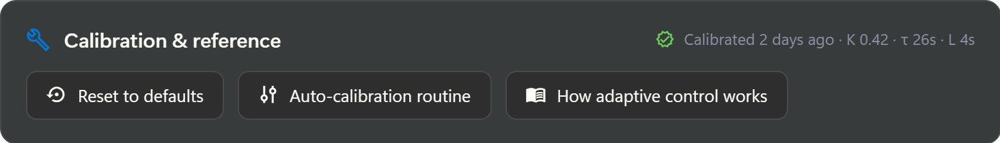

The old bare footer row is gone. These actions now sit in a **card of their own**, same shape as the
other Adaptive sections (icon `wrench-outline` + title → body):

- Header: **"Calibration & reference"**, with the calibration summary right-aligned in the header —
  `check-decagram-outline` + *"Calibrated {age} · K 0.42 · τ 26s · L 4s"*.
- Body: three buttons in one row, **all identical geometry** (`Height=34`, `CornerRadius=8`, 14px
  horizontal padding, 12.5px text, 15px leading icon at 8px gap, `CardBackgroundBrush` fill +
  1px `CardBorderBrush` stroke):

| Button | Icon | Action |
|---|---|---|
| Reset to defaults | `backup-restore` | Restores target 78 °C, floor on, floor 24% — **staged**, not immediate |
| Auto-calibration routine | `tune-vertical-variant` | Opens the calibration wizard |
| How adaptive control works | `book-open-variant` | Opens the control-design explainer (screen 6) |

> Two earlier mistakes fixed here, worth keeping fixed in XAML: **Reset to defaults** was a
> `subtle`-variant button, which renders as bare text and read as a link beside two real buttons —
> give all three the same outlined treatment. And **Recalibrate** was removed: it invoked the same
> command as *Auto-calibration routine*, so it was two buttons for one action.

The uncalibrated state carries the same two entry points: the accent **Calibrate this fan** plus an
outlined **How adaptive control works**.

## Staging behaviour

Target temperature, safety-floor toggle, floor value and the mode switch itself **all stage** —
they flow through the existing dirty/Preview/Apply model and the navigation guard. The
**Release now** latch action is an immediate command, **not** a staged change.

---

# Screen 2 — Optional calibration (the 4-minute test)

**Not a gate, and never presented as required setup.** Retitled throughout: the dialog is
**"Teach {FanLocation} in 4 minutes"** (`clock-fast`, subtitle "Optional shortcut"), and every state
reassures that gradual learning continues regardless.

| State | Title | Subtitle |
|---|---|---|
| Consent | Teach {FanLocation} in 4 minutes | Optional shortcut · {Slot} · {Model} |
| Blocked | Teach {FanLocation} in 4 minutes | The shortcut needs AC power — Adaptive keeps learning either way |
| Running | **Learning** {FanLocation} | Don't run anything on the machine until this finishes |
| Result | SubZero has learned this fan | {FanLocation} · measured just now |
| Failure | The shortcut didn't finish | {FanLocation} · nothing saved, nothing lost |

**Consent** opens with *"Adaptive is **already learning this fan** from ordinary use"*, then two
side-by-side cards making the trade explicit rather than implied:

- *If you skip this* (neutral card) — safe defaults, refines from quiet moments, usable in a day or
  two, fully settled within a week. **"Nothing is wrong in the meantime."**
- *If you run the test* (success-tinted card) — the same numbers measured in one go; four noisy
  minutes, then full accuracy immediately, and it stops needing to learn.

The honest section is headed **"What the test does to your machine"** — the *cost of the shortcut*,
not the price of entry. Footer: **Not now** / **Start the 4-minute test**, with the note
*"Skipping this changes nothing — Adaptive carries on learning by itself."*

> The previous revision's footer note read *"Without this, SubZero will not learn your fans."* That
> is now false and must not ship.

**Blocked on battery** is **warning amber, not danger red** — it blocks the *shortcut*, not the
feature. Title *"The fast version needs AC power"*, closing with **"Nothing is blocked by this.
Adaptive is still learning {FanLocation} from ordinary use, on battery or not — plug in only if you
want the fast version."** No primary button; it unblocks live when AC is attached.

**Failures** — each of the five still names its cause, states nothing was saved and the fans were
restored (and by whom), and now **ends by pointing at gradual learning instead of demanding a
retry**. The temperature-ceiling case says explicitly that you do *not* need to retry, since
gradual learning never runs the machine hot.

**Result** — *"{FanLocation} is learned. Adaptive is now using this model instead of its defaults —
no further learning needed."*

The dialog geometry, the 7-step progress list, the temperature/duty plot with the step change
marked, and the always-available Cancel are unchanged from the previous revision — as is the
plain-language result table and the `TextSize="0"` / zero-padding note for the small chart.

# Screen 2 (previous revision) — dialog anatomy

A modal dialog over the dimmed app (`ContentDialog`). **880 × min 680**, radius 14,
`CardBackgroundBrush`, 1px `#ffffff21` border, shadow `0 32 64 rgba(0,0,0,0.55)`.
Structure: fixed header · scrolling body · fixed footer separated by a 1px divider on
`CardSecondaryBackgroundBrush`.

Header = icon + title + subtitle; both change per state:

| State | Icon / colour | Title | Subtitle |
|---|---|---|---|
| Consent | `tune-vertical-variant` accent | Calibrate {FanLocation} | One-time learning run · {Slot} · {Model} |
| Blocked | `battery-alert-variant-outline` danger | Calibrate {FanLocation} | Cannot start while on battery power |
| Running | `progress-clock` accent | **Learning** {FanLocation} | Don't run anything on the machine until this finishes |
| Result | `check-decagram` success | SubZero has learned this fan | {FanLocation} · measured just now |
| Failure | per-failure icon | Calibration did not finish | {FanLocation} · nothing was saved |

> **Language:** the user-facing verb is **learn**, not "auto-tune" or "identify". "Calibrate"
> survives only as the action name on buttons and the badge.

## Consent


Intro (static): *"Before SubZero can drive this fan adaptively, it has to learn it. It learns two
things: how much the temperature drops per unit of airflow, and how long that takes. It learns
them by deliberately heating the machine, then cooling it, and watching how this fan responds —
and it keeps what it learns for this fan on this machine."*

Then **"WHAT WILL HAPPEN"** — five divider-separated rows, icon + label + sub:

1. `fan-speed-3` **Fans will run to maximum** — "This is loud. Both fans spin up and hold there for part of the run."
2. `cpu-64-bit` **The CPU will be loaded on purpose** — "SubZero generates heat so it has something to measure. The machine may feel sluggish."
3. `hand-back-left-outline` **Leave the machine alone once it starts** — "SubZero applies the load itself — anything you run on top adds heat it isn't expecting and skews the result."
4. `clock-outline` **It takes about 5 minutes** — "Seven short steps. You can stop at any point without leaving anything half-applied."
5. `power-plug` **AC power is required** — "Power limits behave differently on battery, which would skew the measurement."

Bottom: a success banner — *"Running on AC power — {adapter} adapter connected. Ready to start."*

Footer: `alert-circle-outline` "Without this, SubZero will not learn your fans." · **Cancel** · **Start calibration** (accent, `play`).

## Blocked — on battery


Explicit, not a disabled button with no reason. Danger banner **"Calibration needs AC power"** +
*"This machine is running on battery. Calibration loads the CPU and runs the fans at maximum for
several minutes, which would drain the battery and skew the measurement — power limits behave
differently when unplugged."*

Then **"CURRENT POWER STATE"** — two tiles: Power source `Battery`, Charge `{n}%`.
Closing line: *"Connect the charger and this dialog will unblock on its own."*

**No primary button.** Footer note "Waiting for AC power." + **Close**. The dialog must
**re-evaluate live** and unblock when AC is attached.

## Running


Top: the amber **"Don't use the machine while this runs"** banner (`hand-back-left-outline`) —
*"SubZero controls the CPU load itself. Anything you start — a game, a build, a video call — adds
heat it isn't expecting and the measurement will be wrong. Leave it alone until it finishes."*

Then current step name · `Step {n} of 7` · `{remaining} left`, and a 6px accent progress bar.

**Temperature response plot** (from the server-streamed updates): temperature (danger red, 2.4px)
and fan duty (accent, 1.8px, 75% opacity) against time, with the **step change marked** by a
dashed warning vertical line labelled "Fan → 100%", and a dot on the live head of the temp trace.
Live readouts under it: Driving temp · Fan (RPM + %) · Package power.

> **LiveCharts note:** small charts need `TextSize="0"` and `Padding="0,0"` on the axes or they
> render nothing.

**The seven steps**, listed with `check-circle` (done) / `progress-clock` (active, pulsing) /
`circle-outline` (pending):

| # | Label | Note |
|---|---|---|
| 1 | Settling at idle | baseline temperature |
| 2 | Finding minimum spin | lowest duty that keeps turning |
| 3 | Stepping fan to maximum | step change applied |
| 4 | Loading the CPU | raising heat on purpose |
| 5 | Measuring temperature response | watching the curve settle |
| 6 | Fitting the thermal model | identifying K, τ and L |
| 7 | Verifying speed tracking | cascade or duty fallback |

Footer: note *"Cancelling is safe at any point — nothing is written until it completes."* +
**Cancel calibration** (danger). **Cancel is prominent and available at every moment** — there is
no secondary button competing with it.

## Result


Success banner: *"{FanLocation} is calibrated. Adaptive mode is now available for it."*

**"WHAT SUBZERO LEARNED"** — plain language first, value on the right, jargon in the sub-line:

| Label | Value | Sub |
|---|---|---|
| How much this fan cools | `0.42 °C per 1%` | Temperature drop for each extra percent of fan duty |
| How fast it responds | `26 s` | Time to reach most of the change after a speed adjustment |
| Delay before it takes effect | `4 s` | Dead time between commanding a speed and seeing temperature move |
| Slowest it can safely turn | `1,180 RPM` | Below this the fan stalls — used as the safety floor default (17%) |

**EC-tracking verdict** — its own card, in plain language:
- cascade → `check-network-outline` success, **"This fan takes speed commands directly"** —
  *"The controller asked for specific speeds and the fan reached them, so SubZero will command RPM
  and let the firmware handle the motor. That gives the steadiest, quietest result."*
- duty fallback → same shape, warning tone, explaining SubZero will command duty instead.

Control-theory numbers are demoted to a single tertiary footnote:
*"Derived gains — Kp 41.8 · Ki 1.62 · identified K 0.42 · τ 26 s · L 4 s"*.

Footer: **Close** · **Use Adaptive mode** (accent) — which closes the dialog and leaves the fan
editor on Adaptive, staged.

## Failures — distinct copy per cause


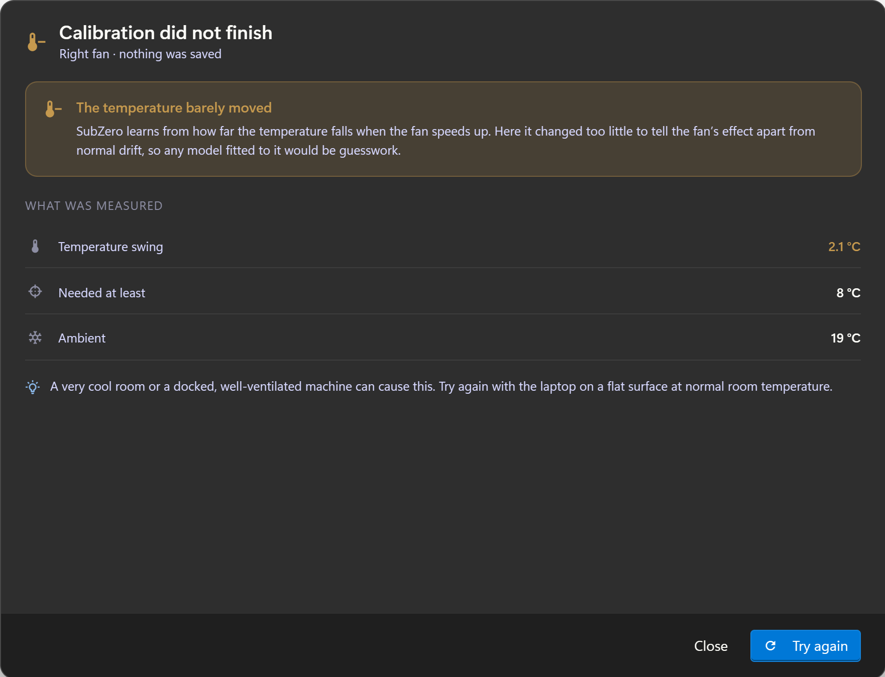
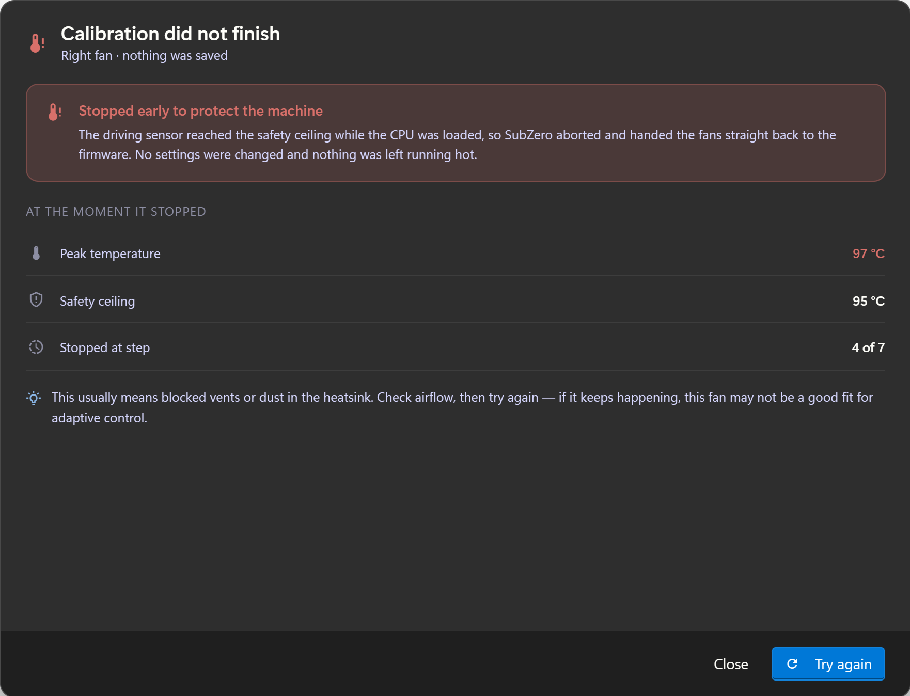
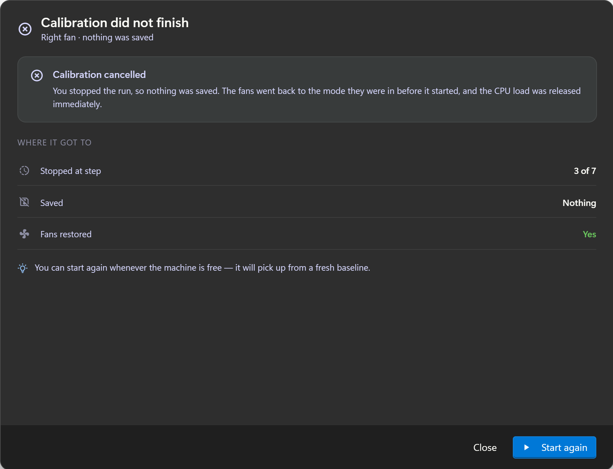
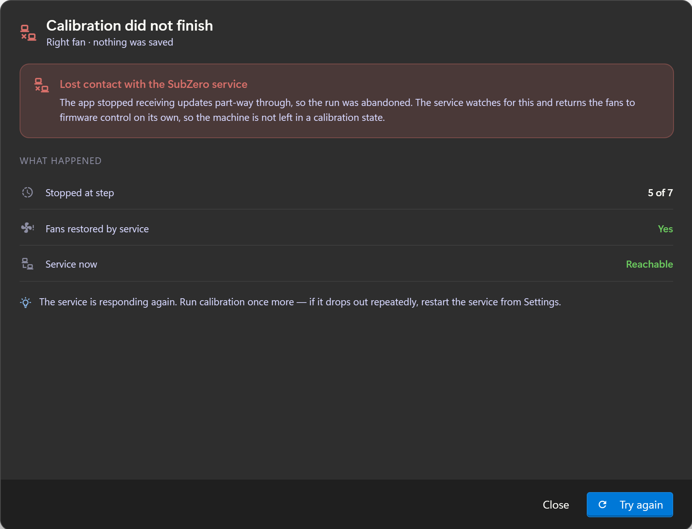

All five share one layout: severity banner (icon + title + body) → **measured-values table** →
`lightbulb-on-outline` advice line → footer **Close** + a retry primary. Never a generic error.

| Cause | Tone | Title | Table rows | Advice / primary |
|---|---|---|---|---|
| Insufficient load | warning | The machine never got busy enough | Average package power `6.4 W`; Needed at least `25 W`; Ran for `2 min 41 s` | Set Windows to Balanced/Best performance, close anything limiting the CPU · **Try again** |
| Insufficient ΔT | warning | The temperature barely moved | Temperature swing `2.1 °C`; Needed at least `8 °C`; Ambient `19 °C` | Cool room or well-ventilated dock causes this; retry at normal room temperature · **Try again** |
| Temperature ceiling | danger | Stopped early to protect the machine | Peak temperature `97 °C`; Safety ceiling `95 °C`; Stopped at step `4 of 7` | Usually blocked vents or dust; check airflow · **Try again** |
| Cancelled | neutral | Calibration cancelled | Stopped at step `3 of 7`; Saved `Nothing`; Fans restored `Yes` | Start again whenever the machine is free · **Start again** |
| Client disconnected | danger | Lost contact with the SubZero service | Stopped at step `5 of 7`; Fans restored by service `Yes`; Service now `Reachable` | Retry; if it repeats, restart the service from Settings · **Try again** |

Every failure states explicitly that **nothing was saved** and that the **fans were restored** —
the temperature-ceiling and disconnect cases say *who* restored them (service-side watchdog).

---

# Screen 3 — Dashboard: profiles are user profiles


## What changed and why

The old tiles (Silent / Balanced / Performance / Turbo / Custom) were **duty shortcuts** — each
just slammed every fan to a fixed percentage. They are now **saved user configurations**.

A profile stores a **per-fan map of mode + settings**, e.g.

```
Balanced (default)
  Left fan   → Custom curve
  Right fan  → Adaptive, target 78 °C
  APU fan    → Manual 45%
  Front fan  → Auto
```

Applying a profile switches every fan's mode at once. Shipped examples: **Silent**,
**Balanced** (ᴅᴇꜰᴀᴜʟᴛ), **Gaming**, **Render** — each tile shows name, a ᴅᴇꜰᴀᴜʟᴛ marker where
applicable, and a subtitle describing the **actual configuration** ("Curves on CPU fans ·
Adaptive 78 °C on GPU"), not a mood.

- A final **dashed "New profile" tile** (`plus`) creates one from the current state.
- Header carries **Manage profiles** (`pencil-outline`) and, when the live configuration no
  longer matches the applied profile, a **Modified** chip (warning) + **Save as profile**.
- Editing any fan sets `profile = custom` → the Modified chip appears; **no tile is highlighted**.

**Where profiles are authored:** recommend the **Fan Control** page rather than a separate page —
a profile is a snapshot of exactly what that page already edits. A dedicated page only earns its
place if profiles gain triggers (auto-switch on AC/battery, on launch, on app detection). Not
built either way — decide before implementing.

## Per-fan controls — the mode conflict


Previously each card showed Auto/Manual/Max **and** a ± duty stepper at all times, so the stepper
contradicted the selected mode, and Custom curve was missing entirely.

Now each card has **all five modes** as a compact icon segmented control
(`auto-fix`, `tune-variant`, `chart-bell-curve`, `speedometer`, `tune-vertical-variant`), and the
**control row underneath changes with the mode**:

| Mode | Control row |
|---|---|
| Manual | − / **Duty {n}%** / + stepper (the **only** place duty is editable) |
| Custom curve | `chart-bell-curve` "Curve · {n} sensors · {duty}% now" + **Edit** link |
| Adaptive | `tune-vertical-variant` "Holding {target} · {duty}% now" + **Tune** link |
| Max | `speedometer` "Full speed · 100% commanded" (warning icon) |
| Auto | `auto-fix` "Firmware policy · {duty}% now" (tertiary) |

The per-card **Boost** button was removed — it was a second way to say Max.

The card keeps its gauge (`{rev/s}` centre), the location + slot + function pill, and a "Now
driving" line showing the effective mode and duty.

---

## Static vs bound

**Static text** (ships in XAML, never changes at runtime): all section titles and headings, the
five consent rows, the seven step labels and their notes, the failure titles/bodies/advice, the
Controller term names (Feed-forward, PI trim, Lead, Throttle escalation), the target-temperature
and safety-floor explanations, the "what SubZero learned" labels and sub-lines, and the
tracking/latch copy templates.

**Bound** (everything numeric, stateful or per-fan):

| Binding | Used by |
|---|---|
| `Fan.Location`, `Fan.Slot`, `Fan.Function` | headers, fan list, all dialog titles |
| `Fan.CurrentRpm`, `Fan.DutyPercent` | gauges, Actual, "{n}% now" |
| `Fan.DrivingTemperature` | Controller temp vs target |
| `Fan.CalibrationState` (`None`/`Ok`/`Stale`) + `CalibratedAt` | mode pill, uncalibrated lockout, list badges |
| `Adaptive.TargetTemperature`, `.SafetyFloorEnabled`, `.SafetyFloorPercent` | editor controls (staged) |
| `Adaptive.MinSpinRpm` | floor caption |
| `Controller.SetpointRpm` + `.FeedForward/.PiTrim/.Lead/.ThrottleEscalation` | contribution bar + legend |
| `Controller.ThrottleLatched`, `.LatchedAt`, `.LatchReleaseSeconds` | latched banner |
| `Calibration.Step`, `.StepCount`, `.RemainingEstimate`, `.TemperatureSeries`, `.DutySeries`, `.PackagePowerWatts` | wizard progress + plot |
| `Calibration.Result.{K, Tau, L, MinSpinRpm, Kp, Ki, TrackingMode}` | result screen |
| `Calibration.Failure.{Reason, MeasuredValues}` | failure screens |
| `Power.IsOnAc`, `Power.AdapterWatts`, `Power.ChargePercent` | consent banner, blocked state |
| `Profiles[]`, `ActiveProfile`, `IsModified` | Dashboard profile tiles |

All temperatures, speeds, powers, voltages and currents render through
**`IUnitFormattingService`** — including slider bounds.

---

| File | Screen |
|------|--------|
| `fan-control/01-adaptive-calibrated.png` | Adaptive editor — controller readout + latched escalation |
| `fan-control/02-adaptive-uncalibrated.png` | Adaptive — uncalibrated lockout |
| `calibration/01-consent.png` | Wizard — consent |
| `calibration/02-blocked-on-battery.png` | Wizard — blocked on battery |
| `calibration/03-running.png` | Wizard — running |
| `calibration/04-result.png` | Wizard — result |
| `calibration/05-failure-insufficient-load.png` | Failure — insufficient load |
| `calibration/06-failure-insufficient-delta-t.png` | Failure — insufficient ΔT |
| `calibration/07-failure-temperature-ceiling.png` | Failure — temperature ceiling |
| `calibration/08-failure-cancelled.png` | Cancelled |
| `calibration/09-failure-client-disconnected.png` | Failure — client disconnected |
| `fan-control/04-calibration-reference-island.png` | Optional tools card (formerly Calibration & reference) |
| `confidence/00-all-12-states.png` | **All 4 treatments × 3 learning states** — the confidence reference sheet |
| `control-explainer/00-full-page.png` | Control-design explainer — whole page |
| `control-explainer/01-plant-fopdt.png` | Explainer — measured step response + FOPDT |
| `control-explainer/02-simc-lambda.png` | Explainer — SIMC λ knob |
| `control-explainer/03-cascade.png` | Explainer — cascade chain + tracking verdict |
| `control-explainer/04-control-law-terms.png` | Explainer — control-law terms & guards |
| `control-explainer/05-provenance.png` | Explainer — measured vs decided |
| `dashboard/01-profiles-and-fans.png` | Dashboard — profiles |
| `dashboard/02-fan-modes-detail.png` | Dashboard — per-fan mode controls |

---

# Screen 6 — Control design explainer

`Adaptive Control Explained.dc.html` — a **reference page**, reached from the *How adaptive control
works* button in the Adaptive editor. Its job: make every Adaptive number accountable, and separate
what was **measured on this machine** from what was **decided once and shipped**.

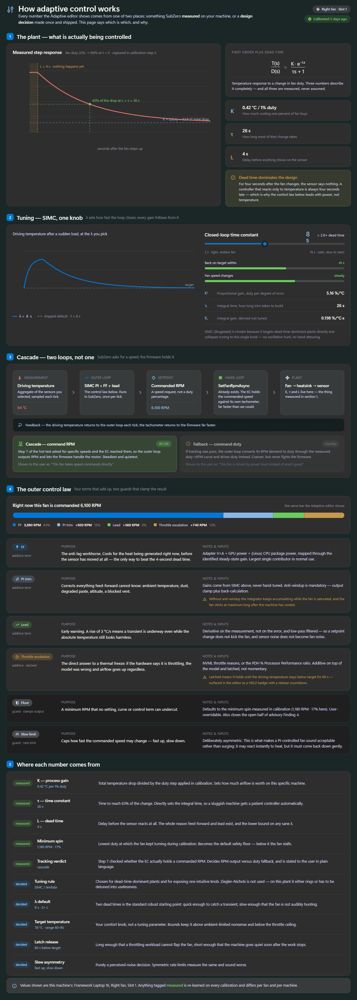

Same page shell as every other screen (title bar + icon rail untouched), one scrolling content
column capped at 1180px. Five numbered sections; each number badge is a 24×24 accent square,
`CornerRadius=7`, `SemiBold` 13px.

## 1. The plant — what is actually being controlled

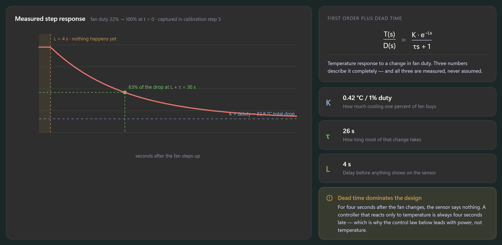

Left: the **measured step response** (fan duty 22% → 100% at t = 0, from calibration step 5), drawn
as a line chart with three annotations *in the plot*, not in a legend:

| Annotation | Colour | Meaning |
|---|---|---|
| Shaded band + dashed vertical at t = L | warning | "L = 4 s · nothing happens yet" |
| Dashed horizontal asymptote | `#8AB7E8` violet | "K × Δduty = 32.8 °C total drop" |
| Dashed cross-hair + dot at L + τ | success | "63% of the drop at L + τ = 30 s" |

Right column: the **FOPDT transfer function** rendered as a real fraction (`T(s)/D(s) ≈ K·e^−Ls /
(τs + 1)`) — build it as stacked `TextBlock`s with a 1px `Rectangle` divider, not an image — then
three value tiles (K, τ, L) and a warning callout, **"Dead time dominates the design"**, explaining
why the control law leads with power rather than temperature.

## 2. Tuning — SIMC, one knob

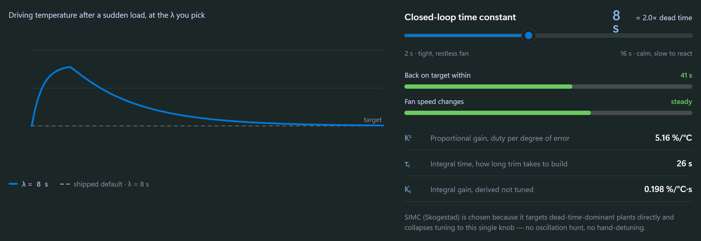

An **interactive** section: a `Slider` for λ (2–16 s) redraws the disturbance-response curve against
a dashed ghost of the shipped default (λ = 8 s), and recomputes everything derived from it:

- Header value: λ in seconds + *"= {n}× dead time"*.
- Two consequence bars — **Back on target within** `(λ + L) × 3.4` s (turns warning above 58 s) and
  **Fan speed changes** (`restless` ≤ 4 s → `busy` → `steady` → `very calm` ≥ 11 s).
- Derived-gain rows: `Kᶜ = τ / (K(λ + L))` %/°C, `τᵢ = min(τ, 4(λ + L))` s, `Kᵢ = Kᶜ / τᵢ`.
- Closing line: SIMC (Skogestad) chosen because it targets dead-time-dominant plants and collapses
  tuning to one knob.

**Ziegler–Nichols is deliberately not shown.** It appears once, in the provenance table, as a
rejected option — not as a side-by-side comparison.

## 3. Cascade — two loops, not one

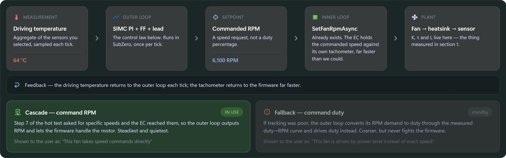

A five-block chain, each block a tile (`kind` label, icon, title, body, optional signal value) with
`chevron-right` between them:

`Driving temperature (64 °C)` → `SIMC PI + FF + lead` → `Commanded RPM (6,100)` → `SetFanRpmAsync`
→ `Fan → heatsink → sensor`

Beneath: a dashed feedback strip, then the **step-7 tracking verdict** as two cards — *Cascade —
command RPM* and *Fallback — command duty*. The active one is tinted and badged **IN USE**; the
other is `CardBackgroundBrush` at 62% opacity, badged *standby*. Each states the plain-language
sentence the user sees in the wizard.

## 4. The outer control law

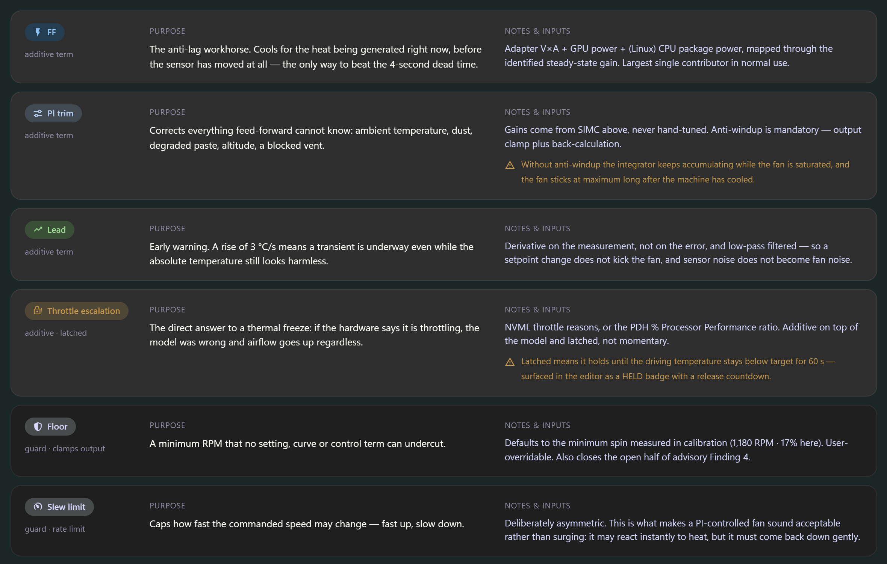

The same stacked contribution bar as the Adaptive editor (FF 3,880 · PI trim 920 · Lead 560 ·
Throttle escalation 740 = **6,100 RPM**), each term's share as a percentage, then one row per term —
**Purpose** and **Notes & inputs** side by side:

| Term | Role | Purpose | Inputs / notes |
|---|---|---|---|
| **FF** | additive | Anti-lag workhorse — cools for heat generated *now*, before the sensor moves | Adapter V×A + GPU power + (Linux) CPU package power, through the identified steady-state map |
| **PI trim** | additive | Corrects what FF cannot know: ambient, dust, degraded paste, altitude | Gains from SIMC. **Anti-windup mandatory** — clamp + back-calculation |
| **Lead** | additive | Early warning — 3 °C/s means a transient is underway even at a benign absolute temperature | Derivative on **measurement**, not error; low-pass filtered |
| **Throttle escalation** | additive · **latched** | The direct answer to the freeze | NVML throttle reasons, or PDH % Processor Performance ratio |
| **Floor** | guard · clamps output | Minimum RPM no setting can undercut | Defaults to measured min spin (1,180 RPM · 17%). Overridable |
| **Slew limit** | guard · rate limit | Fast up, slow down (asymmetric) | What makes a PI-controlled fan sound acceptable rather than surging |

The two **guards** use a recessed card (`CardSecondaryBackgroundBrush`) and a neutral chip, so they
read as constraints on the result rather than contributions to it. Two rows carry amber inline
warnings: PI trim's anti-windup consequence (*fan sticks at maximum long after cooling*) and the
latch's 60-second release rule.

## 5. Where each number comes from

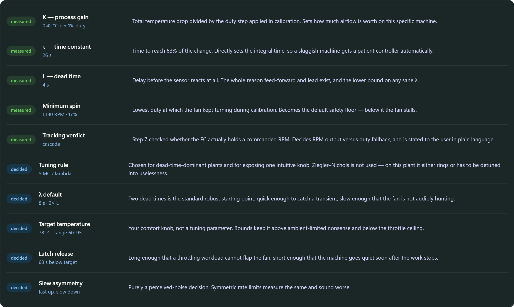

A ten-row table, each row tagged **measured** (success chip) or **decided** (accent chip), with the
value and a one-sentence reason. Measured: K, τ, L, minimum spin, tracking verdict. Decided: tuning
rule (SIMC — and why not Ziegler–Nichols), λ default (8 s = 2× L), target range (60–95 °C), latch
release (60 s below target), slew asymmetry.

Closing note: values are this machine's; anything **measured** is re-learned on every calibration
and differs per fan and per machine.

## Static vs bound (explainer)

All prose, section titles, term names, purposes, notes and provenance reasons are **static**. Bound:
the five measured values (K, τ, L, min spin, tracking verdict), the contribution figures, the live
λ and every gain derived from it, and the chart geometries computed from K/τ/L. The λ slider is a
**what-if control on this page only** — it must not write the shipped λ.

## Tweaks exposed

`defaultLambda` (range 2–16 s, default 8) and `trackingVerdict` (`cascade` | `duty`) — flip the
latter to preview the duty-fallback verdict as the active one.

## Not built yet (from the workstream brief)

Screens 3–6 of the original brief are additive to surfaces that already exist and were
deliberately deferred until the Adaptive vocabulary settled. They still need designs:

1. **Calibration status in the fan list** — per-fan calibrated / not-calibrated / stale badge
   reusing the existing status-pill geometry, plus a recalibrate entry point. *(The data model is
   already in the prototype: `Left` ok, `Right` ok, `APU` none, `Front` stale.)*
2. **Settings: polling tiers** — three clamped interval controls, each explained by what it
   governs, with an honest note that a faster primary tier costs CPU.
3. **Telemetry surfaces** — GPU power / temperature / clock / throttle reasons, and a
   partial-data state for Windows AMD/Intel (utilisation only) that reads as a stated platform
   limitation with a reason, not a blank cell.
4. **Warnings** — an entry for Adaptive running without feed-forward power data, explaining the
   degraded mode.
