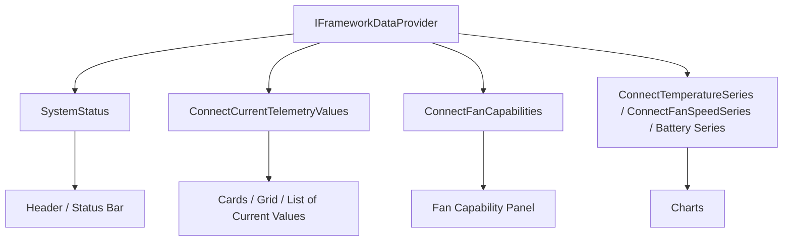

# Telemetry UI Guide

This document is the handoff point between the telemetry backend and your UI layer.

The backend is ready. You can now design screens, charts, controls, and interactions on top of `IFrameworkDataProvider` without adding more plumbing first.

## What Exists Now

The main backend contract is `IFrameworkDataProvider`.

- Live system/device state via `SystemStatus`
- Latest raw snapshots via `FlashSnapshots`, `FanCapabilitiesSnapshots`, `PowerSnapshots`, `ThermalSnapshots`
- Retained raw history for the last hour via `Connect*History(...)`
- Current normalized readings via `ConnectCurrentTelemetryValues()`
- Current fan capability state via `ConnectFanCapabilities()`
- Rolling chart feeds via `ConnectTelemetrySeries(...)`
- Friendlier chart helpers for common UI cases:
  - `ConnectTemperatureSeries(...)`
  - `ConnectFanSpeedSeries(...)`
  - `ConnectBatteryChargeSeries(...)`
  - `ConnectBatteryPresentRateSeries(...)`
  - `ConnectBatteryPresentVoltageSeries(...)`
- Explicit polling lifecycle via `SetPolling(...)`, `StartPolling()`, `StopPolling()`, and `RefreshAsync()`

## Data Shapes You Bind To

### `FrameworkSystemStatus`

Use this for header and diagnostic state.

- Device model
- Platform and platform family
- Library version and informational version
- Supported drivers
- Active driver
- EC build info
- Polling enabled/open state
- Last error

### `CurrentTelemetryValue`

Use this for current-value cards, rows, tiles, and summary lists.

- `ChannelId`: stable logical identity for a metric
- `DisplayName`: UI-ready name such as `Sensor 0 Temperature`
- `UnitSymbol`: unit string such as `C`, `RPM`, `V`
- `ObservedAt`: timestamp of latest reading
- `NumericValue`: latest numeric value or `null`
- `IsAvailable`: availability flag
- `DisplayValue`: formatted string for simple UI surfaces

### `FanCapabilityState`

Use this for fan settings UI, capability badges, or conditional command enablement.

- `FanIndex`
- `DisplayName`
- `Features`
- `SupportsFanControl`
- `SupportsThermalReporting`
- `ObservedAt`
- `IsAvailable`

### `TelemetryPoint`

Use this for charts.

- `ChannelId`
- `ObservedAt`
- `NumericValue`

The series APIs already roll over time and expire old points automatically.

## Polling Rules

Polling is intentionally explicit and UI-controlled.

- Call `SetPolling(interval)` before polling starts
- `SetPolling(...)` returns `false` if polling is already running
- Call `StopPolling()` before changing interval
- Call `StartPolling()` when your UI is ready to begin live telemetry
- Call `RefreshAsync()` for a manual one-shot refresh path

Recommended flow:

1. User picks an interval.
2. View model calls `SetPolling(interval)`.
3. View model calls `StartPolling()`.
4. UI subscribes to the current-value caches and selected chart series.
5. When interval changes, stop polling first, set a new interval, then start again.

## Recommended UI Composition

```text
+----------------------------------------------------------------------------------+
| Device Header                                                                    |
| Model | Platform | Active Driver | EC Build | Polling Interval | Last Error      |
+--------------------------------------+-------------------------------------------+
| Current Readings                     | Live Chart                                |
| Temperature sensors                  | Selected channel                          |
| Fan RPM                              | Window: 5m / 15m / 1h                     |
| Battery charge / rate / voltage      |                                           |
+--------------------------------------+-------------------------------------------+
| Fan Capabilities                                                                  |
| Fan 0: control yes/no, reporting yes/no                                           |
| Fan 1: control yes/no, reporting yes/no                                           |
+----------------------------------------------------------------------------------+
| Diagnostics / Raw Snapshot Panels (optional)                                     |
+----------------------------------------------------------------------------------+
```

## Architecture Sketch



## Recommended View Model Split

Do not force everything into `MainModel`.

Prefer a dedicated telemetry-facing model or feature model, for example:

- `TelemetryDashboardModel`
- `TelemetryChartModel`
- `FanControlModel`
- `DiagnosticsModel`

That keeps screen composition flexible and avoids hardcoding one chart or one polling behavior into the template model.

## DynamicData Usage Pattern

When consuming the caches in Uno MVVM, bind them into `ReadOnlyObservableCollection<T>` in the view model.

```csharp
using System.Collections.ObjectModel;
using System.Reactive.Disposables;
using System.Reactive.Linq;
using System.Threading;

using DynamicData.Binding;

using SubZeroFramework.Models;
using SubZeroFramework.Services;

public sealed class TelemetryDashboardModel : IDisposable
{
    private readonly CompositeDisposable _subscriptions = new();
    private readonly SynchronizationContext? _uiContext = SynchronizationContext.Current;

    public TelemetryDashboardModel(IFrameworkDataProvider frameworkDataProvider)
    {
        ObserveOnUi(frameworkDataProvider.ConnectCurrentTelemetryValues())
            .Bind(out ReadOnlyObservableCollection<CurrentTelemetryValue> currentValues)
            .Subscribe()
            .DisposeWith(_subscriptions);

        ObserveOnUi(frameworkDataProvider.ConnectFanCapabilities())
            .Bind(out ReadOnlyObservableCollection<FanCapabilityState> fanCapabilities)
            .Subscribe()
            .DisposeWith(_subscriptions);

        ObserveOnUi(frameworkDataProvider.ConnectTemperatureSeries(0, TimeSpan.FromMinutes(5)))
            .Bind(out ReadOnlyObservableCollection<TelemetryPoint> temperatureSeries)
            .Subscribe()
            .DisposeWith(_subscriptions);

        CurrentValues = currentValues;
        FanCapabilities = fanCapabilities;
        TemperatureSeries = temperatureSeries;
    }

    public ReadOnlyObservableCollection<CurrentTelemetryValue> CurrentValues { get; }

    public ReadOnlyObservableCollection<FanCapabilityState> FanCapabilities { get; }

    public ReadOnlyObservableCollection<TelemetryPoint> TemperatureSeries { get; }

    public void Dispose() => _subscriptions.Dispose();

    private IObservable<T> ObserveOnUi<T>(IObservable<T> source)
        => _uiContext is null ? source : source.ObserveOn(_uiContext);
}
```

## Choosing Between Generic and Friendly APIs

Use the friendly APIs when your UI already knows the metric type.

- `ConnectTemperatureSeries(sensorIndex, window)`
- `ConnectFanSpeedSeries(fanIndex, window)`
- `ConnectBatteryChargeSeries(batteryIndex, window)`

Use the generic APIs when the UI is picker-driven or channel-driven.

- `ConnectTelemetryChannels()` to show what exists
- `ConnectTelemetrySeries(channelId, window)` to render the selected channel

`TelemetryChannelId` is the stable key for a metric.

## Suggested Screen-Level Responsibilities

### Header / shell area

Drive from `SystemStatus`.

- Device name
- Platform
- Active driver
- Polling state
- Error text

### Current readings surface

Drive from `ConnectCurrentTelemetryValues()`.

- good for lists, tiles, grouped cards, and compact dashboards
- if order matters, sort in the view model or view layer

### Fan settings / info surface

Drive from `ConnectFanCapabilities()`.

- enable or disable fan-control commands from `SupportsFanControl`
- show reporting support from `SupportsThermalReporting`

### Charts

Start with the friendly series methods.

- temperature chart: `ConnectTemperatureSeries(...)`
- fan RPM chart: `ConnectFanSpeedSeries(...)`
- battery chart: `ConnectBatteryChargeSeries(...)`, `ConnectBatteryPresentRateSeries(...)`, `ConnectBatteryPresentVoltageSeries(...)`

Move to `ConnectTelemetryChannels()` plus `ConnectTelemetrySeries(...)` when the user can pick any channel dynamically.

## Why `MainModel` Was Trimmed

The app template model should not silently decide telemetry behavior.

The previous version of `MainModel` did three things that are too opinionated for a real UI:

- it auto-started polling
- it forced a default 10 second interval
- it hardcoded one five-minute temperature series for sensor `0`

That behavior is now intentionally out of `MainModel` so your real UI models can decide how and when to poll, what charts to show, and how to structure the screen.

## Suggested First Build-Out

1. Create a dedicated telemetry dashboard view model.
2. Add polling controls to that model.
3. Bind `SystemStatus` to your header.
4. Bind `ConnectCurrentTelemetryValues()` to your current-value surface.
5. Bind `ConnectFanCapabilities()` to fan capability UI.
6. Bind one of the friendly series methods to your first chart.
7. If you add a metric picker later, switch to `ConnectTelemetryChannels()` plus `ConnectTelemetrySeries(...)`.

## Current Status

The backend telemetry layer is ready for UI work.

You do not need more provider plumbing before building the dashboard, charts, or control surfaces.
