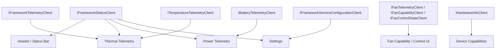

# Telemetry UI Guide

This document is the handoff point between the service-backed IPC clients and your UI layer.

The backend and client abstractions are ready. New UI should compose status, telemetry, inventory, and configuration surfaces on top of typed clients such as `IFrameworkStatusClient`, `IFrameworkTelemetryClient`, `ITemperatureTelemetryClient`, `IFanTelemetryClient`, `IBatteryTelemetryClient`, `IFanCapabilityClient`, `IFanControlStateClient`, `IHardwareInfoClient`, and `IFrameworkServiceConfigurationClient`.

Do not reintroduce direct `IFrameworkDataProvider` usage into the Uno client.

## Current client surface

### `IFrameworkStatusClient`

Use this for header, transport health, device eligibility, and last-observed state.

- `GetStatusAsync()`
- `WatchStatus()`
- `LastObservedAt`
- `EndpointValidation`

### `IFrameworkTelemetryClient`

Use this for picker-driven or generic telemetry UI.

- `WatchTelemetryChannels()`
- `WatchCurrentTelemetryValues()`
- `WatchTelemetrySeries(channelId, historyWindow)`

### Specialized telemetry clients

Use these when the page already knows its domain.

- `ITemperatureTelemetryClient`: `WatchTemperatures()`, `WatchTemperatureHistory(...)`
- `IFanTelemetryClient`: `WatchFans()`, `WatchFanHistory(...)`
- `IBatteryTelemetryClient`: `WatchBatteries()`, `WatchBatteryHistory(...)`
- `IFanCapabilityClient`: `WatchFanCapabilities()`
- `IFanControlStateClient`: `WatchFanControlStates()`

### Inventory and service-owned configuration

- `IHardwareInfoClient`: `GetHardwareInfoAsync()`, `WatchHardwareInfo()`, `WatchHardwareInfoHistory(...)`
- `IFrameworkServiceConfigurationClient`: read, watch, and update service-owned polling cadence and fan-command authorization

## Data shapes you bind to

### `FrameworkSystemStatus`

Use this for header and diagnostic state.

- device model and platform
- active driver and EC build info
- transport and connection state
- last telemetry observed time
- authorization and availability messaging
- last error

### `CurrentTelemetryValue`

Use this for current-value cards, rows, summary tiles, and picker-driven lists.

- `ChannelId`
- `DisplayName`
- `UnitSymbol`
- `ObservedAt`
- `NumericValue`
- `IsAvailable`
- `DisplayValue`

### Domain snapshots

Use specialized snapshots when the page already knows what it is rendering.

- `TemperatureTelemetrySnapshot`
- `FanTelemetrySnapshot`
- `BatteryTelemetrySnapshot`
- `FanCapabilityState`
- `FanControlStateSnapshot`

### `TelemetryPoint`

Use this for retained charts.

- `ChannelId`
- `ObservedAt`
- `NumericValue`
- `SampleId`

### `HardwareInfoSnapshot`

Use this for inventory and inventory-backed history surfaces, including Device Capabilities CPU package charts, per-core usage cards, grouped graphics cards, and monitor associations.

## Service-owned cadence and configuration

Polling is no longer a UI-controlled start or stop concern.

- the service owns background polling
- Settings updates the polling cadence through `IFrameworkServiceConfigurationClient`
- UI surfaces should treat `FrameworkSystemStatus.LastTelemetryObservedAt` or `IFrameworkStatusClient.LastObservedAt` as heartbeat indicators, not as a signal to start polling themselves
- fan-command authorization is also service-owned configuration and should not be mirrored as a client-local toggle

## Chart defaults and retained history

When you build charts:

- keep window labels and separator-step defaults in `PresentationDefaults`
- call `TimeChartAxisHelper.BuildAxis(historyPoints, historyWindow, PresentationDefaults.StandardTelemetryHistorySeparatorStep)` to compute axis limits and separators
- sort retained point collections by `ObservedAt` and `SampleId` before binding so lines stay chronological
- keep long-lived `ObservableCollection<T>`, `ISeries[]`, `Axis[]`, and card models instead of recreating them on every update
- expose bound item collections as `ReadOnlyObservableCollection<T>` when a list, grid, or repeater needs stable item identity

For overview-style recent-history cards, `PresentationDefaults.RecentTelemetryHistoryWindow` and `PresentationDefaults.RecentTelemetryHistoryWindowLabel` are the shared defaults.

## Architecture sketch



## Recommended view-model split

Do not force everything into `MainModel`.

Prefer feature-facing models such as:

- `HeaderModel` or a shell health model
- `ThermalTelemetryModel`
- `PowerTelemetryModel`
- `DeviceCapabilitiesModel`
- `FanControlModel`
- `SettingsModel`

That keeps composition flexible and avoids hardcoding one chart or one cadence decision into a template model.

## Example subscription pattern

```csharp
public sealed class ThermalTelemetryPanelModel : IDisposable
{
    private readonly CompositeDisposable _subscriptions = [];

    public ThermalTelemetryPanelModel(
        IFrameworkStatusClient statusClient,
        ITemperatureTelemetryClient temperatureClient,
        SynchronizationContext uiContext)
    {
        statusClient
            .WatchStatus()
            .ObserveOn(uiContext)
            .Subscribe(status => LastStatus = status)
            .DisposeWith(_subscriptions);

        temperatureClient
            .WatchTemperatures()
            .ObserveOn(uiContext)
            .Subscribe(ApplyTemperatureChanges)
            .DisposeWith(_subscriptions);
    }

    public FrameworkSystemStatus? LastStatus { get; private set; }

    private void ApplyTemperatureChanges(IChangeSet<TemperatureTelemetrySnapshot, int> set)
    {
        // Update stable card models in place.
    }

    public void Dispose() => _subscriptions.Dispose();
}
```

When a history stream uses `ToCollection()`, sort it before converting to chart points:

```csharp
_temperatureTelemetryClient
    .WatchTemperatureHistory(sensorIndex, historyWindow)
    .ToCollection()
    .ObserveOn(uiContext)
    .Subscribe(points =>
    {
        HistoryPoints =
        [
            .. points
                .OrderBy(point => point.ObservedAt)
                .ThenBy(point => point.SampleId)
        ];
    });
```

## Choosing between generic and specialized clients

Use `IFrameworkTelemetryClient` when the UI is channel-picker driven or otherwise generic.

Use specialized clients when the page already knows the metric family.

- thermal pages: `ITemperatureTelemetryClient`
- fan pages and capability surfaces: `IFanTelemetryClient`, `IFanCapabilityClient`, `IFanControlStateClient`
- battery and power pages: `IBatteryTelemetryClient`
- inventory and inventory-backed history cards: `IHardwareInfoClient`

## Suggested screen-level responsibilities

### Header / shell area

Drive from `IFrameworkStatusClient.WatchStatus()`.

- service reachability
- library and device eligibility
- telemetry heartbeat
- last error

### Current readings and charts

Drive from specialized telemetry clients or `IFrameworkTelemetryClient`.

- thermal current cards and history
- fan RPM cards and history
- battery and power current cards and history

### Device Capabilities and overview cards

Drive from `IHardwareInfoClient.WatchHardwareInfo()` and `WatchHardwareInfoHistory(...)`.

- CPU package cards with recent usage and frequency history
- per-core usage cards
- graphics-card groups and monitor cards
- storage, network, memory, and firmware inventory

### Settings and lifecycle

Drive from `IFrameworkServiceConfigurationClient` plus status and lifecycle clients.

- polling cadence and fan-command authorization
- readiness messaging and service state
- install/update/restart/shutdown action context

## Current status

The service-backed status, telemetry, inventory, and configuration clients are ready for UI work.

You do not need more provider plumbing before building or extending telemetry surfaces. New pages and controls should stay on the typed IPC client path, preserve stable item identity, and reuse `PresentationDefaults` plus `TimeChartAxisHelper` for chart timing policy instead of rebuilding that logic ad hoc.
